# API Reference

> *"If builders built buildings the way programmers wrote programs, then the first woodpecker that came along would destroy civilization."* - Gerald Weinberg

## Overview

This document provides a visual architecture guide to n8n-deploy's core components, focusing on system design and component relationships rather than implementation details. The system emphasizes modular design, type safety, and clean separation of concerns.

## System Architecture

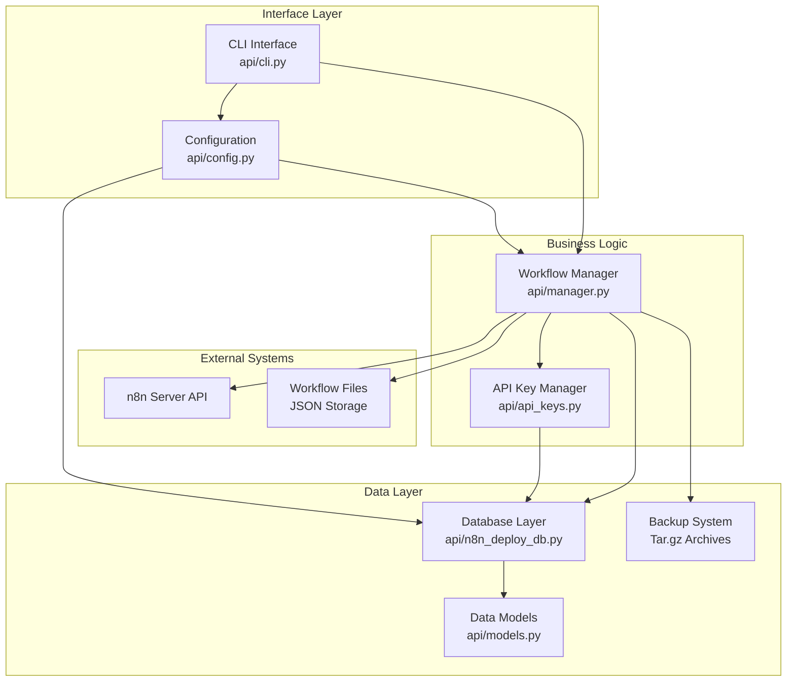
```mermaid
graph TB
    CLI[CLI Interface<br/>api/cli.py] --> Manager[Workflow Manager<br/>api/manager.py]
    CLI --> Config[Configuration<br/>api/config.py]

    Manager --> Database[Database Layer<br/>api/n8n_deploy_db.py]
    Manager --> APIKeys[API Key Manager<br/>api/api_keys.py]
    Manager --> N8N[n8n Server API]

    Database --> Models[Data Models<br/>api/models.py]
    APIKeys --> Database

    Config --> Database
    Config --> Manager

    Manager --> FileSystem[Workflow Files<br/>JSON Storage]
    Manager --> Backup[Backup System<br/>Tar.gz Archives]

    subgraph "External Systems"
        N8N
        FileSystem
    end

    subgraph "Data Layer"
        Database
        Models
        Backup
    end

    subgraph "Business Logic"
        Manager
        APIKeys
    end

    subgraph "Interface Layer"
        CLI
        Config
    end
```

## Data Models & Schema

### Core Models Overview

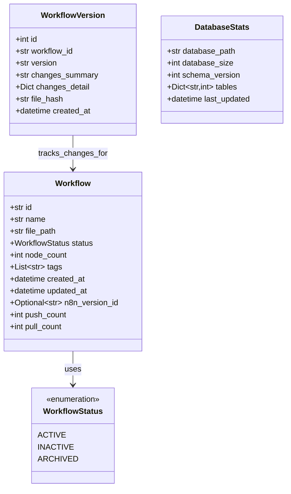
```mermaid
classDiagram
    class WorkflowStatus {
        <<enumeration>>
        ACTIVE
        INACTIVE
        ARCHIVED
    }

    class Workflow {
        +str id
        +str name
        +str file_path
        +WorkflowStatus status
        +int node_count
        +List~str~ tags
        +datetime created_at
        +datetime updated_at
        +Optional~str~ n8n_version_id
        +int push_count
        +int pull_count
    }

    class WorkflowVersion {
        +int id
        +str workflow_id
        +str version
        +str changes_summary
        +Dict changes_detail
        +str file_hash
        +datetime created_at
    }

    class DatabaseStats {
        +str database_path
        +int database_size
        +int schema_version
        +Dict~str,int~ tables
        +datetime last_updated
    }

    Workflow --> WorkflowStatus : uses
    WorkflowVersion --> Workflow : tracks_changes_for
```

### Model Relationships

- **Workflow**: Core entity representing n8n workflow with metadata, file references, and sync tracking
- **WorkflowStatus**: Simple enumeration for lifecycle management (active, inactive, archived)
- **WorkflowVersion**: Version tracking for change management and rollback capabilities
- **DatabaseStats**: System health and metrics information

### Key Design Principles

- **Type Safety**: All models use Pydantic for validation and type enforcement
- **Timestamp Tracking**: Automatic creation and update timestamp management
- **n8n Integration**: Built-in fields for server synchronization tracking
- **Extensible Tags**: Flexible tagging system for workflow organization

### Database Schema

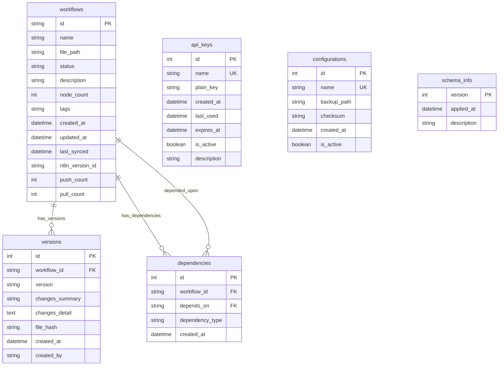
```mermaid
erDiagram
    workflows {
        string id PK
        string name
        string file_path
        string status
        string description
        int node_count
        string tags
        datetime created_at
        datetime updated_at
        datetime last_synced
        string n8n_version_id
        int push_count
        int pull_count
    }

    api_keys {
        int id PK
        string name UK
        string plain_key
        datetime created_at
        datetime last_used
        datetime expires_at
        boolean is_active
        string description
    }

    configurations {
        int id PK
        string name UK
        string backup_path
        string checksum
        datetime created_at
        boolean is_active
    }

    versions {
        int id PK
        string workflow_id FK
        string version
        string changes_summary
        text changes_detail
        string file_hash
        datetime created_at
        string created_by
    }

    schema_info {
        int version PK
        datetime applied_at
        string description
    }

    dependencies {
        int id PK
        string workflow_id FK
        string depends_on FK
        string dependency_type
        datetime created_at
    }

    workflows ||--o{ versions : "has_versions"
    workflows ||--o{ dependencies : "has_dependencies"
    workflows ||--o{ dependencies : "depended_upon"
```

## Configuration System

### Configuration Hierarchy

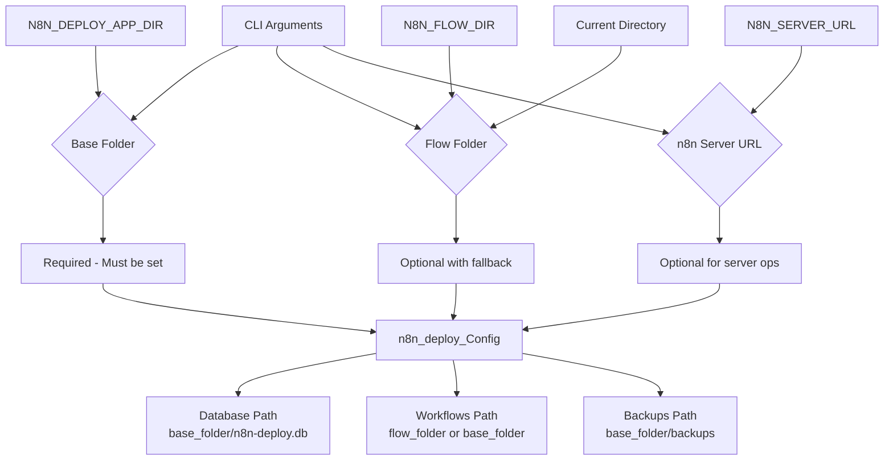
```mermaid
graph TD
    A[CLI Arguments] --> B{Base Folder}
    C[N8N_DEPLOY_APP_DIR] --> B
    B --> D[Required - Must be set]

    A --> E{Flow Folder}
    F[N8N_FLOW_DIR] --> E
    G[Current Directory] --> E
    E --> H[Optional with fallback]

    A --> I{n8n Server URL}
    J[N8N_SERVER_URL] --> I
    I --> K[Optional for server ops]

    D --> L[n8n_deploy_Config]
    H --> L
    K --> L

    L --> M[Database Path<br/>base_folder/n8n-deploy.db]
    L --> N[Workflows Path<br/>flow_folder or base_folder]
    L --> O[Backups Path<br/>base_folder/backups]
```

### Configuration Resolution Priority

1. **CLI Arguments** (highest priority)
2. **Environment Variables** (medium priority)
3. **Default Values** (lowest priority)

### Key Configuration Properties

- **base_folder**: Application data directory (database, backups) - **Required**
- **flow_folder**: User workflow files directory - Optional with fallback
- **n8n_url**: n8n server URL for remote operations - Optional
- **backup_dir**: Custom backup directory - Optional with fallback

### Directory Structure

```
Base Folder (N8N_DEPLOY_APP_DIR)
├── n8n-deploy.db          # SQLite database
└── backups/               # Backup archives
    ├── backup_20240928.tar.gz
    └── backup_20240927.tar.gz

Flow Folder (N8N_FLOW_DIR)
└── workflows/             # User workflow JSON files
    ├── user_onboarding.json
    ├── data_processing.json
    └── notification_system.json
```

## Database Operations

### Core Database Operations

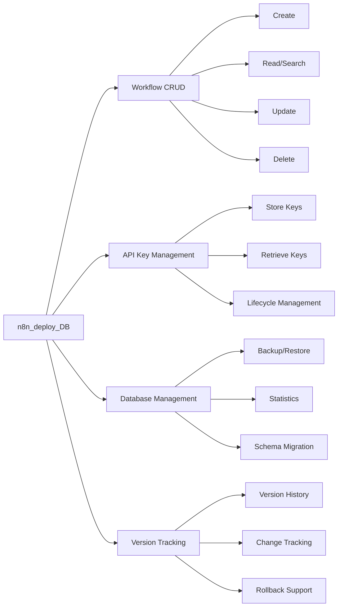
```mermaid
graph LR
    A[n8n_deploy_DB] --> B[Workflow CRUD]
    A --> C[API Key Management]
    A --> D[Database Management]
    A --> E[Version Tracking]

    B --> B1[Create]
    B --> B2[Read/Search]
    B --> B3[Update]
    B --> B4[Delete]

    C --> C1[Store Keys]
    C --> C2[Retrieve Keys]
    C --> C3[Lifecycle Management]

    D --> D1[Backup/Restore]
    D --> D2[Statistics]
    D --> D3[Schema Migration]

    E --> E1[Version History]
    E --> E2[Change Tracking]
    E --> E3[Rollback Support]
```

### Workflow Lifecycle

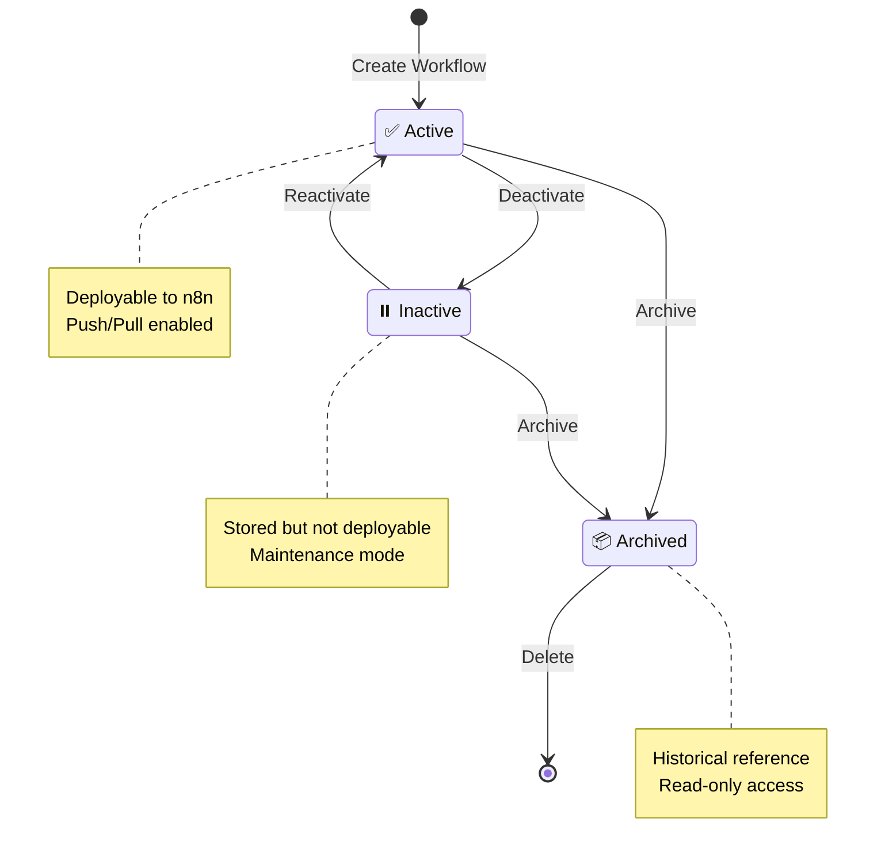
```mermaid
stateDiagram-v2
    [*] --> Active : Create Workflow
    Active --> Inactive : Deactivate
    Inactive --> Active : Reactivate
    Active --> Archived : Archive
    Inactive --> Archived : Archive
    Archived --> [*] : Delete

    Active : ✅ Active
    Inactive : ⏸️ Inactive
    Archived : 📦 Archived

    note right of Active
        Deployable to n8n
        Push/Pull enabled
    end note

    note right of Inactive
        Stored but not deployable
        Maintenance mode
    end note

    note right of Archived
        Historical reference
        Read-only access
    end note
```

### Database Transaction Pattern

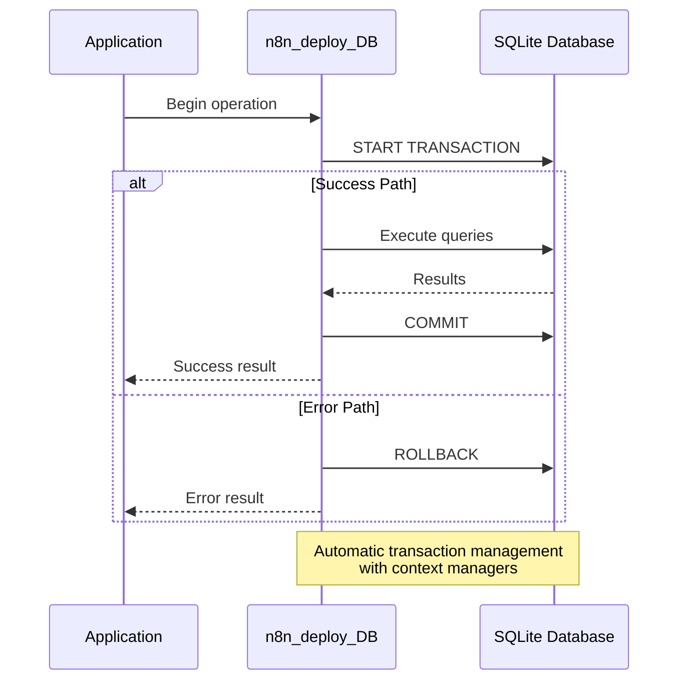
```mermaid
sequenceDiagram
    participant App as Application
    participant DB as n8n_deploy_DB
    participant SQLite as SQLite Database

    App->>DB: Begin operation
    DB->>SQLite: START TRANSACTION

    alt Success Path
        DB->>SQLite: Execute queries
        SQLite-->>DB: Results
        DB->>SQLite: COMMIT
        DB-->>App: Success result
    else Error Path
        DB->>SQLite: ROLLBACK
        DB-->>App: Error result
    end

    Note over DB,SQLite: Automatic transaction management<br/>with context managers
```

### Key Operations

- **Workflow CRUD**: Create, read, update, delete workflow metadata
- **Search & Filter**: Query workflows by name, tags, status, and content
- **Versioning**: Track changes and enable rollback capabilities
- **Statistics**: Database health metrics and usage analytics
- **Backup/Restore**: Data protection and disaster recovery

## Workflow Management

### Workflow Manager Architecture


```mermaid
graph TB
    WM[WorkflowManager] --> FileOps[File Operations]
    WM --> ServerOps[n8n Server Integration]
    WM --> BackupOps[Backup & Restore]
    WM --> Analytics[Analytics & Stats]

    FileOps --> AddFile[Add from File]
    FileOps --> AddData[Add from Data]
    FileOps --> UpdateFile[Update from File]
    FileOps --> ExportFile[Export to File]

    ServerOps --> Push[Push to n8n]
    ServerOps --> Pull[Pull from n8n]
    ServerOps --> Sync[Sync Operations]
    ServerOps --> ListRemote[List Remote Workflows]

    BackupOps --> CreateBackup[Create Backup]
    BackupOps --> RestoreBackup[Restore Backup]
    BackupOps --> VerifyBackup[Verify Integrity]
    BackupOps --> ListBackups[List Available]

    Analytics --> WorkflowStats[Workflow Statistics]
    Analytics --> DependencyAnalysis[Dependency Analysis]
    Analytics --> UsageMetrics[Usage Metrics]
```

### Workflow Import/Export Flow

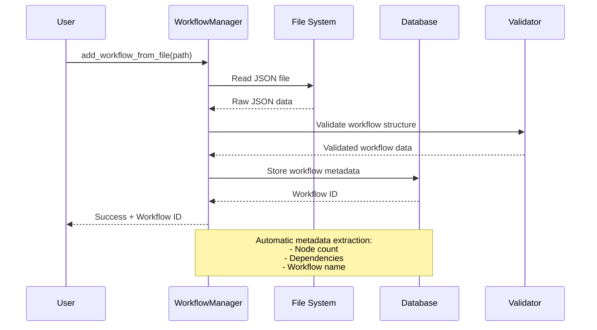
```mermaid
sequenceDiagram
    participant User
    participant WM as WorkflowManager
    participant FS as File System
    participant DB as Database
    participant Validator

    User->>WM: add_workflow_from_file(path)
    WM->>FS: Read JSON file
    FS-->>WM: Raw JSON data
    WM->>Validator: Validate workflow structure
    Validator-->>WM: Validated workflow data
    WM->>DB: Store workflow metadata
    DB-->>WM: Workflow ID
    WM-->>User: Success + Workflow ID

    Note over WM,DB: Automatic metadata extraction:<br/>- Node count<br/>- Dependencies<br/>- Workflow name
```

### n8n Server Integration

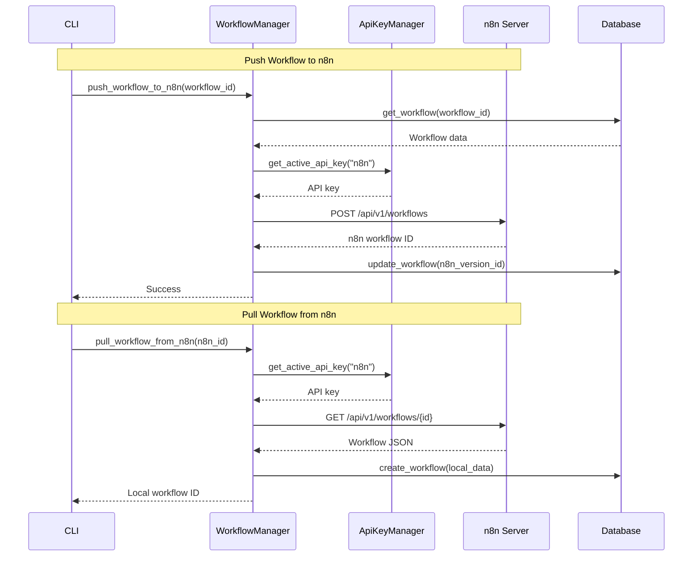
```mermaid
sequenceDiagram
    participant CLI
    participant WM as WorkflowManager
    participant API as ApiKeyManager
    participant N8N as n8n Server
    participant DB as Database

    Note over CLI,N8N: Push Workflow to n8n

    CLI->>WM: push_workflow_to_n8n(workflow_id)
    WM->>DB: get_workflow(workflow_id)
    DB-->>WM: Workflow data
    WM->>API: get_active_api_key("n8n")
    API-->>WM: API key
    WM->>N8N: POST /api/v1/workflows
    N8N-->>WM: n8n workflow ID
    WM->>DB: update_workflow(n8n_version_id)
    WM-->>CLI: Success

    Note over CLI,N8N: Pull Workflow from n8n

    CLI->>WM: pull_workflow_from_n8n(n8n_id)
    WM->>API: get_active_api_key("n8n")
    API-->>WM: API key
    WM->>N8N: GET /api/v1/workflows/{id}
    N8N-->>WM: Workflow JSON
    WM->>DB: create_workflow(local_data)
    WM-->>CLI: Local workflow ID
```

### Server Authentication Flow

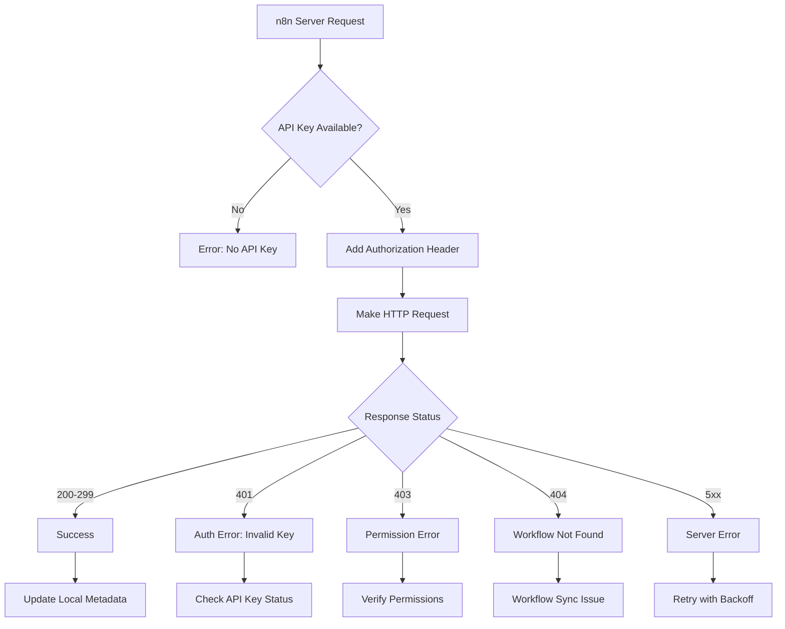
```mermaid
graph TD
    A[n8n Server Request] --> B{API Key Available?}
    B -->|No| C[Error: No API Key]
    B -->|Yes| D[Add Authorization Header]
    D --> E[Make HTTP Request]
    E --> F{Response Status}
    F -->|200-299| G[Success]
    F -->|401| H[Auth Error: Invalid Key]
    F -->|403| I[Permission Error]
    F -->|404| J[Workflow Not Found]
    F -->|5xx| K[Server Error]

    G --> L[Update Local Metadata]
    H --> M[Check API Key Status]
    I --> N[Verify Permissions]
    J --> O[Workflow Sync Issue]
    K --> P[Retry with Backoff]
```

### Backup & Restore Operations

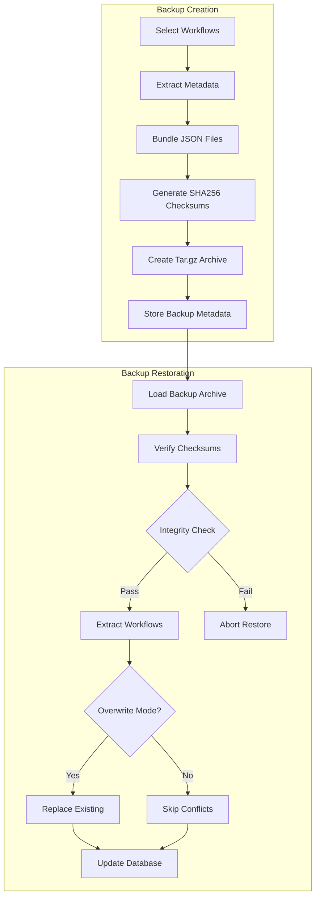
```mermaid
graph TB
    subgraph "Backup Creation"
        A[Select Workflows] --> B[Extract Metadata]
        B --> C[Bundle JSON Files]
        C --> D[Generate SHA256 Checksums]
        D --> E[Create Tar.gz Archive]
        E --> F[Store Backup Metadata]
    end

    subgraph "Backup Restoration"
        G[Load Backup Archive] --> H[Verify Checksums]
        H --> I{Integrity Check}
        I -->|Pass| J[Extract Workflows]
        I -->|Fail| K[Abort Restore]
        J --> L{Overwrite Mode?}
        L -->|Yes| M[Replace Existing]
        L -->|No| N[Skip Conflicts]
        M --> O[Update Database]
        N --> O
    end

    F --> G
```

### Backup Archive Structure

```
backup_20240928_143022.tar.gz
├── metadata.json              # Backup metadata & checksums
├── workflows/                 # Workflow JSON files
│   ├── user_onboarding.json
│   ├── data_processing.json
│   └── notification_system.json
└── database_export.json      # Workflow metadata export
```

### Analytics & Monitoring

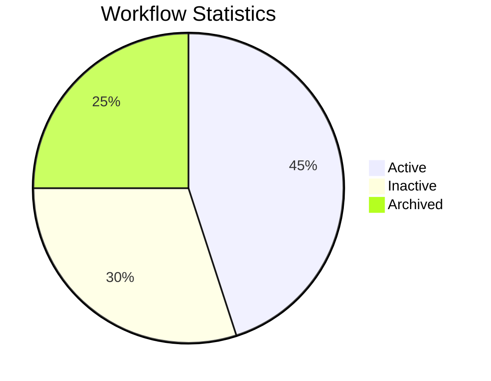
```mermaid
pie title Workflow Statistics
    "Active" : 45
    "Inactive" : 30
    "Archived" : 25
```

**Key Metrics Tracked:**
- Workflow count by status
- Push/pull operation frequency
- Node distribution analysis
- Tag usage patterns
- Sync success rates
- Backup creation frequency

## API Key Management

### API Key Lifecycle

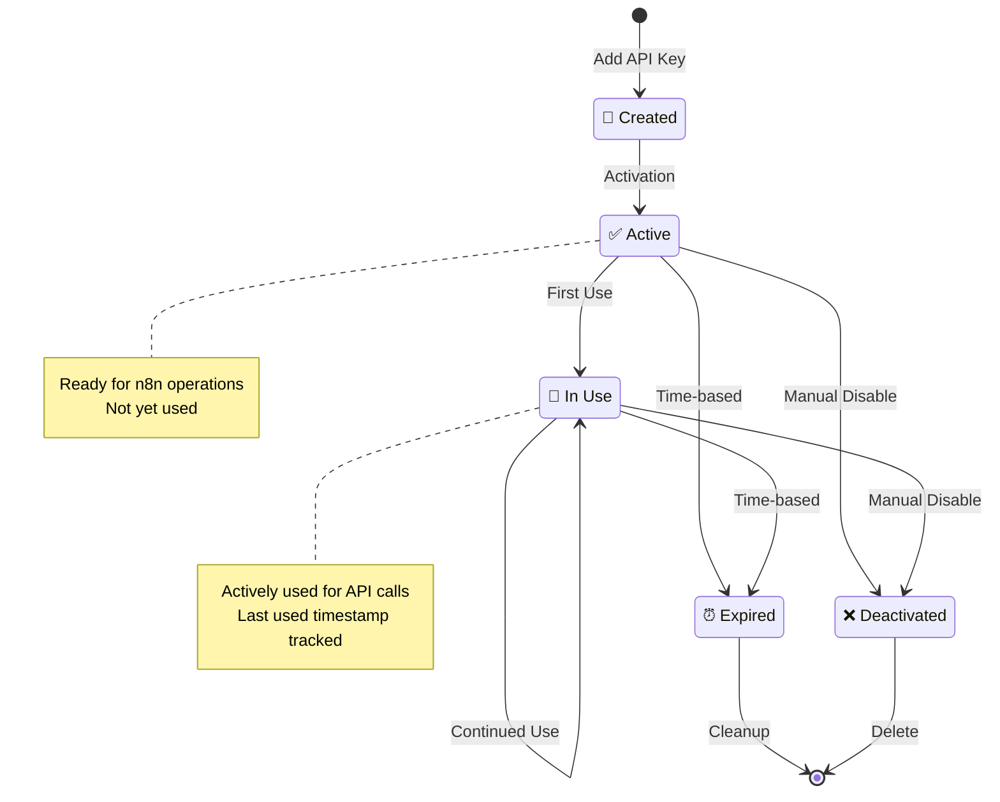
```mermaid
stateDiagram-v2
    [*] --> Created : Add API Key
    Created --> Active : Activation
    Active --> Used : First Use
    Used --> Used : Continued Use
    Active --> Expired : Time-based
    Used --> Expired : Time-based
    Active --> Deactivated : Manual Disable
    Used --> Deactivated : Manual Disable
    Expired --> [*] : Cleanup
    Deactivated --> [*] : Delete

    Created : 🔑 Created
    Active : ✅ Active
    Used : 🔄 In Use
    Expired : ⏰ Expired
    Deactivated : ❌ Deactivated

    note right of Active
        Ready for n8n operations
        Not yet used
    end note

    note right of Used
        Actively used for API calls
        Last used timestamp tracked
    end note
```

### API Key Storage Model

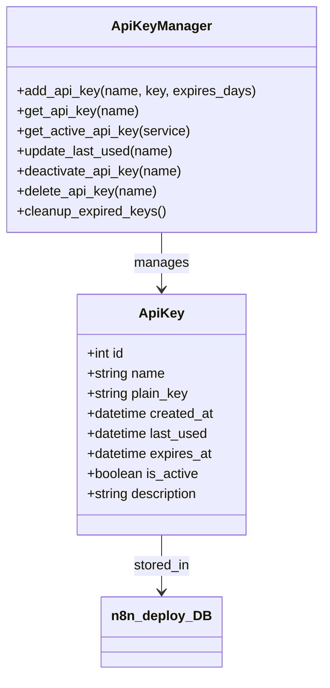
```mermaid
classDiagram
    class ApiKey {
        +int id
        +string name
        +string plain_key
        +datetime created_at
        +datetime last_used
        +datetime expires_at
        +boolean is_active
        +string description
    }

    class ApiKeyManager {
        +add_api_key(name, key, expires_days)
        +get_api_key(name)
        +get_active_api_key(service)
        +update_last_used(name)
        +deactivate_api_key(name)
        +delete_api_key(name)
        +cleanup_expired_keys()
    }

    ApiKeyManager --> ApiKey : manages
    ApiKey --> n8n_deploy_DB : stored_in
```

### Security Considerations

- **Plain Text Storage**: API keys stored unencrypted for simplicity
- **Expiration Management**: Automatic cleanup of expired keys
- **Usage Tracking**: Last used timestamps for audit trails
- **Lifecycle Control**: Soft deletion via deactivation before hard deletion

## CLI Interface

### Command Structure


```mermaid
graph TB
    CLI[n8n-deploy CLI] --> WF[Workflow Commands]
    CLI --> DB[Database Commands]
    CLI --> API[API Key Commands]
    CLI --> BK[Backup Commands]

    WF --> WF1[add - Add workflow from file]
    WF --> WF2[remove - Remove workflow]
    WF --> WF3[list - List workflows]
    WF --> WF4[push - Push to n8n server]
    WF --> WF5[pull - Pull from n8n server]
    WF --> WF6[sync - Synchronize with server]
    WF --> WF7[search - Search workflows]

    DB --> DB1[init - Initialize database]
    DB --> DB2[status - Show database stats]
    DB --> DB3[backup - Create database backup]
    DB --> DB4[compact - Optimize database]

    API --> API1[add-key - Add new API key]
    API --> API2[list-keys - List stored keys]
    API --> API3[delete-key - Remove API key]
    API --> API4[get-key - Retrieve specific key]

    BK --> BK1[create-backup - Archive workflows]
    BK --> BK2[restore-backup - Restore from archive]
    BK --> BK3[list-backups - Show available backups]
    BK --> BK4[verify-backup - Check integrity]
```

### CLI Execution Flow

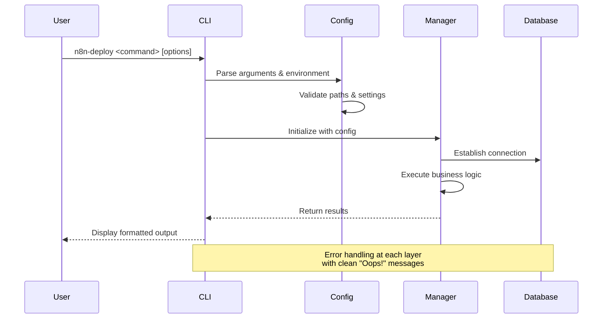
```mermaid
sequenceDiagram
    participant User
    participant CLI
    participant Config
    participant Manager
    participant Database

    User->>CLI: n8n-deploy <command> [options]
    CLI->>Config: Parse arguments & environment
    Config->>Config: Validate paths & settings
    CLI->>Manager: Initialize with config
    Manager->>Database: Establish connection
    Manager->>Manager: Execute business logic
    Manager-->>CLI: Return results
    CLI-->>User: Display formatted output

    Note over CLI,Database: Error handling at each layer<br/>with clean "Oops!" messages
```

### Access Methods

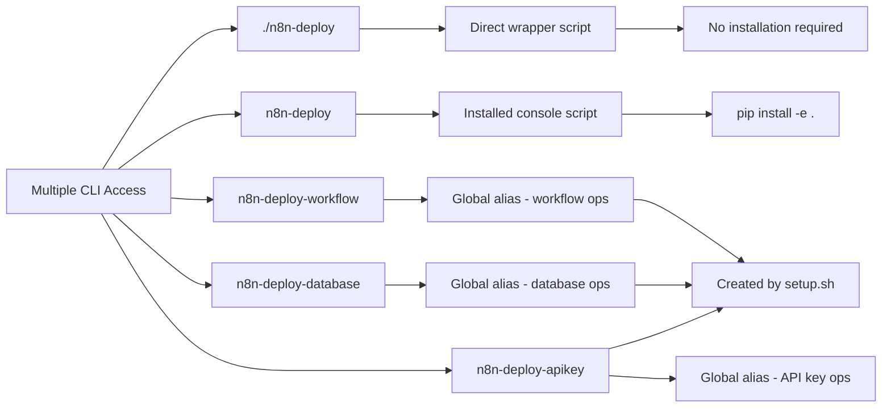
```mermaid
graph LR
    A[Multiple CLI Access] --> B[./n8n-deploy]
    A --> C[n8n-deploy]
    A --> D[n8n-deploy-workflow]
    A --> E[n8n-deploy-database]
    A --> F[n8n-deploy-apikey]

    B --> G[Direct wrapper script]
    C --> H[Installed console script]
    D --> I[Global alias - workflow ops]
    E --> J[Global alias - database ops]
    F --> K[Global alias - API key ops]

    G --> L[No installation required]
    H --> M[pip install -e .]
    I --> N[Created by setup.sh]
    J --> N
    F --> N
```

## Error Handling & Type Safety

### Error Classification

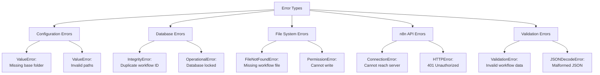
```mermaid
graph TB
    Errors[Error Types] --> Config[Configuration Errors]
    Errors --> DB[Database Errors]
    Errors --> File[File System Errors]
    Errors --> API[n8n API Errors]
    Errors --> Valid[Validation Errors]

    Config --> Config1["ValueError:<br/>Missing base folder"]
    Config --> Config2["ValueError:<br/>Invalid paths"]

    DB --> DB1["IntegrityError:<br/>Duplicate workflow ID"]
    DB --> DB2["OperationalError:<br/>Database locked"]

    File --> File1["FileNotFoundError:<br/>Missing workflow file"]
    File --> File2["PermissionError:<br/>Cannot write"]

    API --> API1["ConnectionError:<br/>Cannot reach server"]
    API --> API2["HTTPError:<br/>401 Unauthorized"]

    Valid --> Valid1["ValidationError:<br/>Invalid workflow data"]
    Valid --> Valid2["JSONDecodeError:<br/>Malformed JSON"]
```

### Error Handling Strategy

- **Clean Error Messages**: "Oops!" style messages without Python tracebacks
- **Layered Handling**: Each component handles its own error domain
- **Graceful Degradation**: Continue operation when possible
- **Rich Output**: Colored error messages for better visibility

### Type Safety Standards

- **Strict MyPy**: Zero errors in strict mode across all modules
- **Comprehensive Annotations**: All public functions have proper type hints
- **External Type Stubs**: Support for third-party libraries (requests, click)
- **Generic Support**: Type-safe collections and optional handling

## Development Quick Reference

### Key Commands

```bash
# Type checking
mypy api/ --strict           # Zero-error requirement

# Testing
python run_tests.py --all    # Full test suite

# Quality checks
black api/                   # Code formatting
```

### Architecture Summary

**n8n-deploy** provides a database-first approach to workflow management with:
- SQLite metadata storage
- n8n server integration
- Backup/restore capabilities
- Type-safe Python API
- Rich CLI interface

The system emphasizes modularity, clean error handling, and comprehensive type safety for reliable workflow operations.

---

*This API reference focuses on architecture understanding through visual diagrams rather than implementation details. For specific code examples, refer to the test suites and CLI help documentation.*
