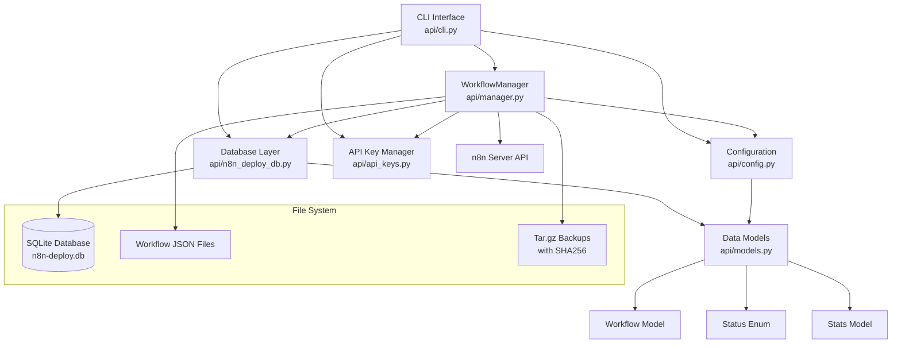
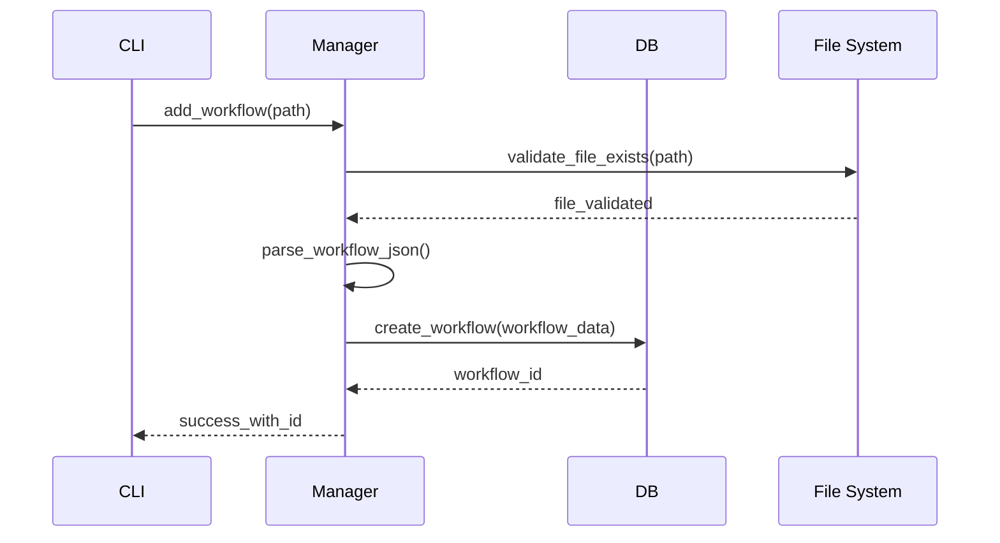
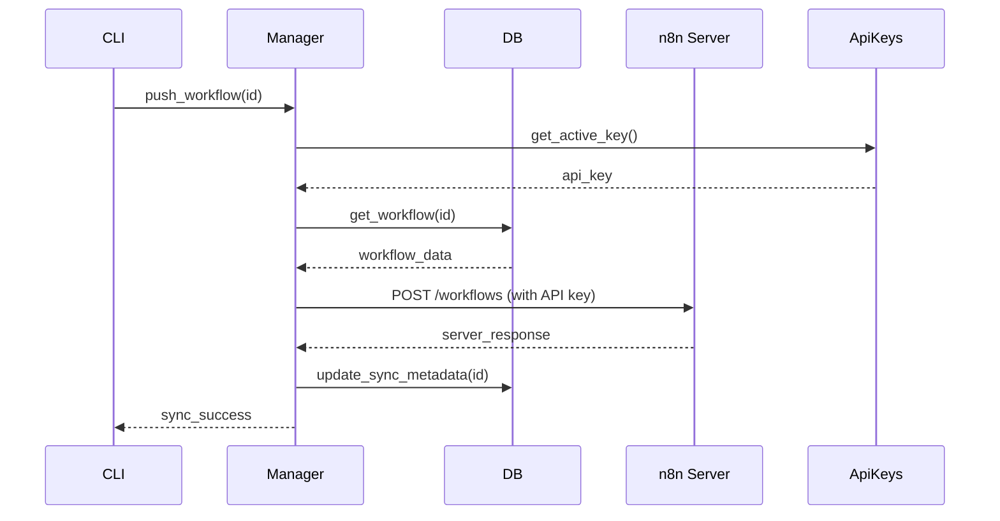
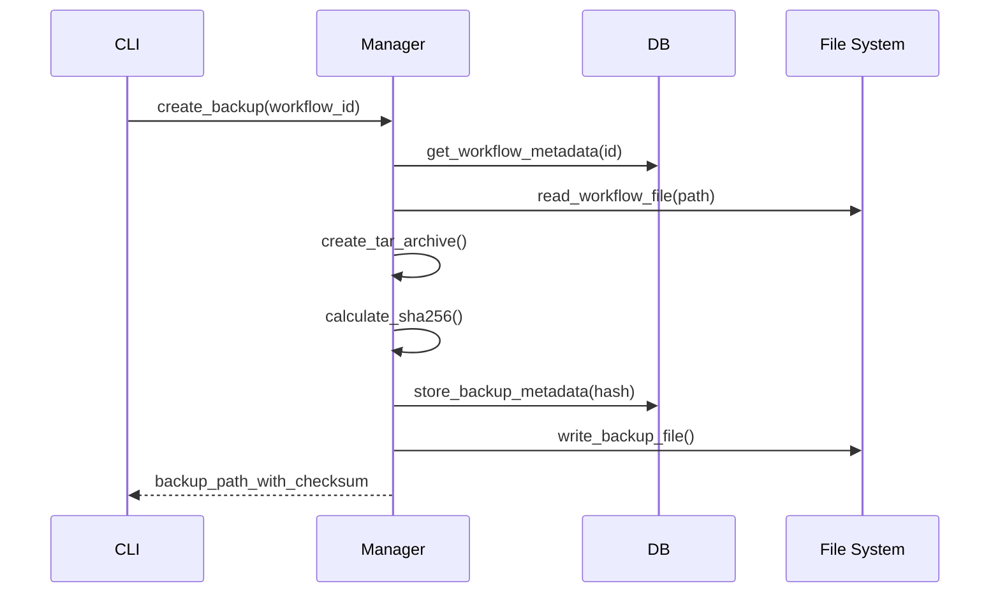

# n8n-deploy Architecture Documentation

## Overview

n8n-deploy is a Python CLI tool designed for managing n8n workflows with SQLite metadata storage. The architecture prioritizes simplicity, type safety, and developer experience while providing robust workflow management capabilities for teams working with n8n automation.

## Core Design Principles

### 1. Database-First Architecture
- **SQLite as single source of truth**: All workflow metadata is stored in SQLite, eliminating dependency on JSON configuration files
- **Schema versioning**: Built-in database migration system for future schema changes
- **Transactional operations**: All database operations use proper transaction handling for data integrity

### 2. Privacy-First Design
- **Zero data collection**: No telemetry, analytics, or external API calls beyond n8n server communication
- **Local-only storage**: All data remains on the local filesystem
- **Plain text API keys**: Simplified storage without encryption complexity (user responsibility for key security)

### 3. Type Safety & Developer Experience
- **Comprehensive type annotations**: All public functions have proper type hints
- **Strict mypy compliance**: Zero errors in strict mode across the entire codebase
- **Rich error messages**: Clean "Oops!" style error handling without Python tracebacks

## Component Architecture



## Core Components

### 1. CLI Interface (`api/cli.py`)

**Purpose**: Primary user interface providing command-line access to all functionality.

**Key Features**:
- **Custom Click Groups**: Enhanced usage formatting for better UX
- **Global flag handling**: Silently discards misplaced flags for robustness
- **Rich output**: Emoji tables by default, `--no-emoji` for scripts
- **Hierarchical configuration**: CLI flags > environment variables > defaults

**Architecture Patterns**:
```python
@click.group(cls=CustomGroup)
def cli():
    """Main CLI group with custom usage formatting"""

@cli.command()
@click.option("--app-dir", help="Override N8N_DEPLOY_APP_DIR")
@click.option("--flow-dir", help="Override N8N_FLOW_DIR")
@click.option("--server-url", help="Override N8N_SERVER_URL")
def command(app_dir, flow_dir, server_url):
    """Standard command pattern with configuration override"""
    try:
        config = get_config(app_dir, flow_dir, server_url)
        # Command implementation
    except ValueError as e:
        console.print(f"[red]{e}[/red]")
        raise click.Abort()
```

### 2. Workflow Manager (`api/manager.py`)

**Purpose**: High-level orchestration layer coordinating between database, n8n API, and file operations.

**Key Responsibilities**:
- Workflow CRUD operations with database synchronization
- n8n server integration (push/pull workflows)
- Backup and restore operations with integrity verification
- File path resolution and workflow JSON handling

**Design Patterns**:
```python
class WorkflowManager:
    def __init__(self, config: Optional[n8n_deploy_Config] = None):
        self.config = config or get_config()
        self.db = n8n_deploy_DB(config=self.config)
        self.api_manager = ApiKeyManager(db=self.db, config=self.config)

    def add_workflow(self, workflow_data: Dict[str, Any]) -> str:
        """Database-first workflow creation with file validation"""
        # Validate file exists and is readable
        # Create database record first
        # Return workflow ID for chaining operations
```

### 3. Database Layer (`api/n8n_deploy_db.py`)

**Purpose**: SQLite abstraction layer with comprehensive workflow metadata management.

**Schema Design** (6 tables):
```sql
-- Core workflow metadata (no type field post-refactoring)
CREATE TABLE workflows (
    id TEXT PRIMARY KEY,
    name TEXT NOT NULL,
    file_path TEXT NOT NULL,
    status TEXT NOT NULL DEFAULT 'active',
    tags TEXT DEFAULT '[]',
    node_count INTEGER DEFAULT 0,
    created_at TIMESTAMP DEFAULT CURRENT_TIMESTAMP,
    updated_at TIMESTAMP DEFAULT CURRENT_TIMESTAMP,
    last_synced TIMESTAMP,
    n8n_version_id TEXT,
    push_count INTEGER DEFAULT 0,
    pull_count INTEGER DEFAULT 0
);

-- Plain text API key storage (simplified post-refactoring)
CREATE TABLE api_keys (
    id INTEGER PRIMARY KEY AUTOINCREMENT,
    name TEXT UNIQUE NOT NULL,
    api_key TEXT NOT NULL,  -- Plain text storage
    created_at TIMESTAMP DEFAULT CURRENT_TIMESTAMP,
    last_used TIMESTAMP,
    expires_at TIMESTAMP,
    is_active BOOLEAN DEFAULT 1,
    description TEXT
);

-- Backup metadata with integrity verification
CREATE TABLE configurations (
    id INTEGER PRIMARY KEY AUTOINCREMENT,
    workflow_id TEXT NOT NULL,
    config_type TEXT NOT NULL,
    config_data TEXT NOT NULL,
    created_at TIMESTAMP DEFAULT CURRENT_TIMESTAMP,
    sha256_hash TEXT,  -- Backup integrity verification
    is_active BOOLEAN DEFAULT 1
);

-- Schema versioning for migrations
CREATE TABLE schema_info (
    version INTEGER PRIMARY KEY,
    applied_at TIMESTAMP DEFAULT CURRENT_TIMESTAMP
);

-- Future-proofing tables (schema-only)
CREATE TABLE versions (...);
CREATE TABLE dependencies (...);
```

**Key Features**:
- **Context manager support**: Automatic connection handling and cleanup
- **Transaction safety**: All multi-operation procedures wrapped in transactions
- **Type-safe queries**: Comprehensive type annotations for all database operations
- **Connection pooling**: Efficient connection reuse with proper lifecycle management

### 4. Configuration System (`api/config.py`)

**Purpose**: Hierarchical configuration management with strict path requirements and validation.

**Configuration Priority** (highest to lowest):
1. **CLI options**: `--app-dir`, `--flow-dir`, `--server-url`
2. **Environment variables**: `N8N_DEPLOY_APP_DIR`, `N8N_FLOW_DIR`, `N8N_SERVER_URL`
3. **Smart defaults**: Current working directory for flow folder

**Path Resolution Logic**:
```python
@dataclass
class n8n_deploy_Config:
    base_folder: Path  # Required - no default
    flow_folder: Optional[Path] = None  # Optional - defaults to base_folder
    n8n_url: Optional[str] = None  # Optional - no server operations if None

    @property
    def database_path(self) -> Path:
        return self.base_folder / "n8n-deploy.db"

    @property
    def workflows_path(self) -> Path:
        return self.flow_folder or self.base_folder

    @property
    def backups_path(self) -> Path:
        return self.base_folder / "backups"
```

**Error Handling**:
- Validation on configuration creation
- Clear "Oops!" error messages for missing required paths
- Directory creation with proper permissions checking

### 5. API Key Management (`api/api_keys.py`)

**Purpose**: Simplified API key storage and lifecycle management for n8n server authentication.

**Design Decisions**:
- **Plain text storage**: No encryption complexity - user responsibility for key security
- **Single service focus**: Designed specifically for n8n API keys
- **Lifecycle management**: Creation, expiration, deactivation, deletion
- **Usage tracking**: Last used timestamps for key rotation planning

**Key Operations**:
```python
class ApiKeyManager:
    def add_api_key(self, name: str, api_key: str,
                   expires_days: Optional[int] = None) -> int:
        """Add API key with optional expiration"""

    def get_active_key(self) -> Optional[str]:
        """Get first active, non-expired key for n8n operations"""

    def deactivate_key(self, name: str) -> bool:
        """Soft delete - mark as inactive but preserve for auditing"""
```

### 6. Data Models (`api/models.py`)

**Purpose**: Pydantic-based data validation and serialization for type-safe operations.

**Core Models**:
```python
class WorkflowStatus(str, Enum):
    ACTIVE = "active"
    INACTIVE = "inactive"
    ARCHIVED = "archived"


class Workflow(BaseModel):
    id: str
    name: str
    file_path: str
    status: WorkflowStatus = WorkflowStatus.ACTIVE
    tags: List[str] = Field(default_factory=list)
    created_at: datetime = Field(default_factory=datetime.utcnow)
    # ... additional metadata fields
```

## Data Flow Patterns

### 1. Workflow Addition Flow


### 2. n8n Server Sync Flow


### 3. Backup Creation Flow


## Error Handling Strategy

### 1. Configuration Errors
- **Clear messaging**: "Base folder is required. Set N8N_DEPLOY_APP_DIR or use `--app-dir`"
- **No Python tracebacks**: Clean error messages without technical stack traces
- **Actionable guidance**: Specific instructions for resolving common configuration issues

### 2. Database Errors
- **Transaction rollback**: Automatic rollback on multi-operation failures
- **Connection recovery**: Automatic retry with exponential backoff for transient issues
- **Schema migration**: Graceful handling of database version mismatches

### 3. File System Errors
- **Path validation**: Comprehensive checking of read/write permissions
- **Graceful degradation**: Partial operations continue when possible
- **Backup integrity**: SHA256 verification prevents corrupted backup usage

## Performance Considerations

### 1. Database Optimization
- **Prepared statements**: Parameterized queries for SQL injection prevention
- **Index strategy**: Optimized indexes on frequently queried columns

### 2. File Operations
- **Lazy loading**: JSON files read only when needed
- **Streaming backups**: Large workflow files handled via streaming
- **Concurrent operations**: Non-blocking I/O where possible

### 3. Memory Management
- **Connection pooling**: Reuse database connections efficiently
- **Context managers**: Automatic resource cleanup
- **Generator patterns**: Memory-efficient iteration over large datasets

## Security Model

### 1. API Key Security
- **User responsibility**: Plain text storage places security burden on user
- **No network transmission**: Keys stored locally only
- **Expiration support**: Built-in key rotation capabilities

### 2. File System Security
- **Permission checking**: Validates read/write access before operations
- **Path validation**: Prevents directory traversal attacks
- **Backup integrity**: SHA256 checksums prevent tampering

### 3. n8n Server Communication
- **HTTPS enforcement**: Automatic upgrade of HTTP URLs to HTTPS
- **SSL verification**: Optional `--skip-ssl-verify` for development environments
- **Authentication**: Bearer token authentication with n8n API keys

## Testing Architecture

### 1. Test Structure
- **Unit tests**: Individual component testing with mocks
- **Integration tests**: Cross-component interaction testing
- **E2E tests**: Real subprocess execution for CLI validation

### 2. Test Isolation
- **Temporary directories**: Each test gets isolated file system
- **In-memory databases**: SQLite `:memory:` for fast unit tests
- **Environment isolation**: `N8N_DEPLOY_TESTING=1` prevents side effects

### 3. CI/CD Integration
- **Multi-version testing**: Python 3.8-3.12 compatibility
- **Parallel execution**: Efficient GitLab CI pipeline design
- **Quality gates**: Type checking, formatting, and coverage requirements

## Future Architecture Considerations

### 1. Planned Modular Refactoring
The documentation mentions a future modular architecture with:
- `api/cli/`: Command modules by functional area
- `api/database/`: Database operations (core, backup, schema)
- `api/workflow/`: Workflow operations (CRUD, n8n API, backup)

### 2. Scalability Enhancements
- **Plugin system**: Extensible command architecture
- **Configuration profiles**: Multiple environment support
- **Bulk operations**: Efficient handling of large workflow sets

### 3. Integration Opportunities
- **Git integration**: Version control for workflow files
- **CI/CD hooks**: Integration with deployment pipelines
- **Monitoring**: Workflow health and performance tracking

---

*This architecture balances simplicity with flexibility, providing a solid foundation for n8n workflow management while maintaining the developer experience that makes the tool approachable for teams of all sizes.*
