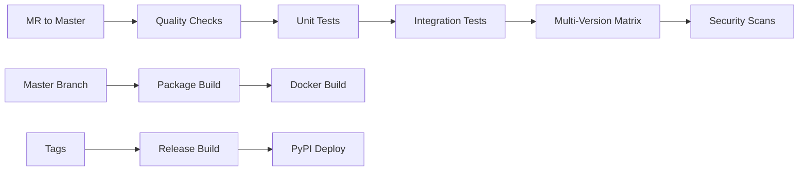

# Contributing Guide

## Overview

Welcome to n8n-deploy development! This guide covers everything you need to know about contributing to the project, from code standards to the GitLab workflow. We maintain high standards for code quality while keeping the contribution process straightforward and developer-friendly.

## Quick Start for Contributors

### 1. Fork and Clone

```bash
# Fork the repository on GitLab first, then:
git clone https://github.com/lehcode/n8n-deploy.git
cd n8n-deploy

# Add your fork as a remote (if using GitLab)
git remote add fork https://gitlab.com/yourusername/n8n-deploy.git
```

### 2. Set Up Development Environment

```bash
# Create development environment
python -m venv .venv
source .venv/bin/activate

# Install with all dependencies
pip install -e ".[dev,test]"
pip install types-requests types-click

# Install pre-commit hooks
pre-commit install

# Verify setup
python run_tests.py --unit
```

### 3. Create Feature Branch

```bash
# Create feature branch from master
git checkout master
git pull origin master
git checkout -b feature/your-feature-name
```

## Code Standards

### 1. Python Code Style

**Formatting with Black**:
```bash
# Auto-format all code
black api/

# Check formatting (CI requirement)
black --check api/

# Configuration in pyproject.toml
[tool.black]
line-length = 100
target-version = ['py39']
```

**Key Style Guidelines**:
- **Line length**: 100 characters maximum
- **Import organization**: Standard library, third-party, local imports
- **Docstrings**: Google-style docstrings for all public functions
- **Variable naming**: `snake_case` for variables, `PascalCase` for classes

### 2. Type Safety Requirements

**Strict MyPy Compliance**:
```bash
# All code must pass strict type checking
mypy api/ --strict

# Zero errors required for CI pass
echo $?  # Must be 0
```

**Type Annotation Patterns**:
```python
# Required: All public functions must have type annotations
def process_workflow(
    workflow_data: Dict[str, Any],
    config: n8n_deploy_Config
) -> str:
    """Process workflow and return workflow ID"""

# Required: Use Optional for nullable parameters
def get_workflow(workflow_id: str) -> Optional[Workflow]:
    """Get workflow by ID, return None if not found"""

# Preferred: Use Union types for complex returns
def api_call(endpoint: str) -> Union[Dict[str, Any], List[Dict[str, Any]]]:
    """API call with flexible return type"""

# Required: Generic types for collections
def list_items(filters: Dict[str, Any]) -> List[Workflow]:
    """List workflows with type-safe return"""
```

### 3. Documentation Standards

**Docstring Requirements**:
```python
def add_workflow_from_file(self, file_path: Union[str, Path]) -> str:
    """
    Add workflow from JSON file to database

    Reads workflow JSON file, validates structure, and creates database
    record with metadata extraction from file content.

    Args:
        file_path: Path to workflow JSON file (absolute or relative)

    Returns:
        str: Unique workflow identifier assigned by database

    Raises:
        FileNotFoundError: If workflow file doesn't exist
        ValueError: If workflow JSON structure is invalid
        json.JSONDecodeError: If file contains malformed JSON
        sqlite3.IntegrityError: If workflow ID conflicts with existing

    Example:
        >>> manager = WorkflowManager(config=config)
        >>> workflow_id = manager.add_workflow_from_file("flows/onboarding.json")
        >>> print(f"Added workflow: {workflow_id}")
    """
```

**Code Comments**:
```python
# Good: Explain why, not what
def calculate_backup_checksum(self, file_path: Path) -> str:
    # Use SHA256 for backup integrity verification
    # This prevents silent corruption during restore operations
    hasher = hashlib.sha256()

    # Process file in chunks to handle large workflow files
    with open(file_path, 'rb') as f:
        for chunk in iter(lambda: f.read(4096), b""):
            hasher.update(chunk)

    return hasher.hexdigest()

# Bad: Explaining what the code does
def calculate_backup_checksum(self, file_path: Path) -> str:
    # Create SHA256 hasher
    hasher = hashlib.sha256()
    # Open file in binary mode
    with open(file_path, 'rb') as f:
        # Read file in 4096 byte chunks
        for chunk in iter(lambda: f.read(4096), b""):
            # Update hasher with chunk
            hasher.update(chunk)
    # Return hexadecimal digest
    return hasher.hexdigest()
```

### 4. Error Handling Standards

**Exception Patterns**:
```python
# CLI error handling (clean user experience)
def cli_command(app_dir: Optional[str]) -> None:
    try:
        config = get_config(base_folder=app_dir)
        # Command implementation
    except ValueError as e:
        # Clean error message without traceback
        console.print(f"[red]{e}[/red]")
        raise click.Abort()

# Library error handling (preserve original exceptions)
def library_function(workflow_id: str) -> Workflow:
    try:
        workflow = self.db.get_workflow(workflow_id)
        if workflow is None:
            raise ValueError(f"Workflow not found: {workflow_id}")
        return workflow
    except sqlite3.OperationalError as e:
        # Re-raise with context but preserve original exception
        raise ValueError(f"Database error accessing workflow {workflow_id}") from e

# Validation with helpful messages
def validate_workflow_data(self, data: Dict[str, Any]) -> None:
    if 'id' not in data:
        raise ValueError("Workflow data must include 'id' field")
    if not isinstance(data['id'], str) or not data['id'].strip():
        raise ValueError("Workflow 'id' must be a non-empty string")
```

## Testing Requirements

### 1. Test Coverage Standards

**Required Coverage**:
- **Unit tests**: All new functions must have unit tests
- **Integration tests**: Cross-component functionality requires integration tests
- **E2E tests**: CLI changes require E2E subprocess tests

**Test Categories**:
```python
# Unit test example
def test_workflow_creation_with_valid_data(mock_workflow_data):
    """Unit test: isolated component testing"""
    workflow = Workflow(**mock_workflow_data)
    assert workflow.id == "test_workflow_123"
    assert workflow.status == WorkflowStatus.ACTIVE

# Integration test example
@pytest.mark.integration
def test_manager_database_integration(test_config):
    """Integration test: component interaction"""
    manager = WorkflowManager(config=test_config)
    workflow_id = manager.add_workflow_from_data(test_data)

    # Verify database persistence
    workflows = manager.list_workflows()
    assert len(workflows) == 1

# E2E test example (CLI changes)
def test_e2e_new_command_functionality(temp_dir):
    """E2E test: real subprocess execution"""
    env = {"N8N_DEPLOY_APP_DIR": str(temp_dir)}
    result = subprocess.run(
        ["./n8n-deploy", "new-command", "--no-emoji"],
        capture_output=True, text=True, env=env
    )
    assert result.returncode == 0
    assert "Expected output" in result.stdout
```

### 2. Test Development Requirements

**Test Naming**:
```python
# Good: Descriptive test names
def test_workflow_creation_with_invalid_json_raises_validation_error():
def test_database_connection_recovers_from_temporary_lock():
def test_cli_list_command_with_no_workflows_shows_empty_table():

# Bad: Generic test names
def test_workflow():
def test_database():
def test_cli():
```

**Test Organization**:
```bash
# Add tests in appropriate locations
tests/unit/test_new_module.py        # New module unit tests
tests/integration/test_new_feature.py # Cross-component tests
tests/integration/test_e2e_manual_new.py # E2E for CLI changes
```

**Test Environment**:
```python
# Always use N8N_DEPLOY_TESTING=1 for integration tests
@pytest.fixture(autouse=True)
def setup_test_environment(environment_vars):
    """Ensure clean test environment"""
    environment_vars["N8N_DEPLOY_TESTING"] = "1"
    yield
```

## Git Workflow

### 1. Branch Strategy

**Branch Types**:
```bash
# Feature development
feature/add-workflow-tags          # New functionality
feature/improve-error-messages     # Enhancements

# Bug fixes
fix/database-connection-leak       # Bug fixes
fix/cli-error-handling            # Error handling improvements

# Documentation
docs/api-reference-update         # Documentation changes
docs/contributing-guide           # Guide updates

# Refactoring (breaking changes)
refactor/modular-architecture     # Major refactoring
refactor/remove-deprecated-apis   # API cleanup
```

**Branch Naming**:
- Use descriptive names with hyphens
- Start with category prefix (`feature/`, `fix/`, `docs/`, `refactor/`)
- Keep names concise but clear about the change

### 2. Commit Message Standards

**Commit Format**:
```bash
# Format: type(scope): description
feat(cli): add workflow tag filtering to list command
fix(database): resolve connection pooling memory leak
docs(api): update workflow manager method documentation
test(integration): add comprehensive backup restore tests

# Breaking changes
feat(api)!: remove deprecated manager.get_workflows() method

# Scope examples
feat(cli): ...          # CLI interface changes
fix(database): ...      # Database layer fixes
docs(contributing): ... # Documentation updates
test(unit): ...         # Test additions/fixes
```

**Commit Message Guidelines**:
- **First line**: 50 characters max, imperative mood
- **Body**: Wrap at 72 characters, explain why not what
- **Footer**: Reference issues, breaking changes

```bash
# Good commit message
feat(cli): add --tags filter option to list command

Allow users to filter workflows by tags using comma-separated
tag list. This enables better workflow organization and discovery
in large installations.

Resolves: #123
```

### 3. Pull Request Process

**Before Creating PR**:
```bash
# Ensure all tests pass
python run_tests.py --all

# Verify code quality
python run_tests.py --quality

# Update from master
git checkout master
git pull origin master
git checkout feature/your-branch
git rebase master  # or merge master

# Final test run
python run_tests.py --all-e2e
```

**PR Requirements**:
1. **Descriptive title**: Clear summary of changes
2. **Detailed description**: What, why, and how
3. **Test evidence**: Include test output or screenshots
4. **Documentation updates**: Update relevant docs
5. **No failing tests**: All CI checks must pass

**PR Template**:
```markdown
## Summary
Brief description of changes and motivation

## Changes Made
- [ ] Added new CLI command for workflow tagging
- [ ] Updated database schema for tag storage
- [ ] Added comprehensive test coverage
- [ ] Updated documentation

## Testing
- [ ] Unit tests pass: `python run_tests.py --unit`
- [ ] Integration tests pass: `python run_tests.py --integration`
- [ ] E2E tests pass: `python run_tests.py --e2e`
- [ ] Manual testing completed for edge cases

## Documentation
- [ ] API documentation updated
- [ ] CLI help text updated
- [ ] User guide updated (if applicable)

## Breaking Changes
None / List any breaking changes

## Related Issues
Closes #123
Related to #456
```

## GitLab CI/CD Workflow

### 1. Pipeline Stages

Our GitLab CI uses an efficient **MR-only validation pattern** to reduce resource usage:



**Pipeline Efficiency**:
- **Feature branches**: No CI triggered (saves resources)
- **MR to master**: Full validation pipeline
- **Master branch**: Deployment builds only
- **Tags**: Release pipeline with PyPI upload

### 2. CI Requirements for Contributors

**Quality Gates** (all must pass):
```bash
# Code formatting
black --check api/

# Type checking (strict mode)
mypy api/ --strict

# Unit tests with coverage
python run_tests.py --unit --coverage

# Integration tests
python run_tests.py --integration

# Security scanning (automatic)
# SAST analysis (automatic)
```

**Multi-Version Testing**:
```yaml
# CI tests across Python versions
test:matrix:
  parallel:
    matrix:
      - PYTHON_VERSION: ["3.8", "3.9", "3.10", "3.11", "3.12"]
  script:
    - python -m pytest tests/unit/ -v
```

### 3. Local CI Simulation

**Pre-commit Validation**:
```bash
# Run what CI will run
python run_tests.py --quality      # Black + MyPy
python run_tests.py --unit         # Unit tests
python run_tests.py --integration  # Integration tests

# Multi-version testing (if pyenv available)
for version in 3.8.18 3.9.18 3.10.13 3.11.7 3.12.1; do
    pyenv shell $version
    python -m pytest tests/unit/ -q
done
```

**Docker CI Simulation**:
```bash
# Test in clean container (like CI)
docker run --rm -v $(pwd):/app -w /app python:3.9-slim bash -c "
    apt-get update && apt-get install -y git
    pip install -e .[dev,test]
    pip install types-requests types-click
    python run_tests.py --all
"
```

## Common Development Scenarios

### 1. Adding New CLI Command

**Step-by-step process**:
```bash
# 1. Create feature branch
git checkout -b feature/add-stats-command

# 2. Add command to api/cli.py
@cli.command()
@click.option("--app-dir", type=click.Path())
def stats(app_dir: Optional[str]) -> None:
    """Show workflow statistics"""
    try:
        config = get_config(base_folder=app_dir)
        manager = WorkflowManager(config=config)
        stats = manager.get_workflow_stats()
        # Display stats
    except ValueError as e:
        console.print(f"[red]{e}[/red]")
        raise click.Abort()

# 3. Add manager method (if needed)
def get_workflow_stats(self) -> Dict[str, Any]:
    """Get comprehensive workflow statistics"""
    return {
        "total_count": len(self.list_workflows()),
        "by_status": self._count_by_status(),
        "by_type": self._count_by_type(),
    }

# 4. Add tests
def test_stats_command_shows_workflow_counts(cli_runner, test_config):
    """Test stats command output"""
    result = cli_runner.invoke(cli, ['--app-dir', str(test_config.base_folder), 'stats'])
    assert result.exit_code == 0
    assert "Total workflows:" in result.output

# 5. Add E2E test
def test_e2e_stats_command(temp_dir):
    """E2E test for stats command"""
    env = {"N8N_DEPLOY_APP_DIR": str(temp_dir)}
    result = subprocess.run(
        ["./n8n-deploy", "stats", "--no-emoji"],
        capture_output=True, text=True, env=env
    )
    assert result.returncode == 0

# 6. Update documentation
# Add command to CLI documentation section

# 7. Test and commit
python run_tests.py --all
git add .
git commit -m "feat(cli): add stats command for workflow analytics"
```

### 2. Database Schema Changes

**Migration process**:
```bash
# 1. Update schema version
# In api/n8n_deploy_db.py:
SCHEMA_VERSION = 2

# 2. Add migration logic
def _migrate_to_version_2(self) -> None:
    """Add tags column to workflows table"""
    cursor = self._get_connection().cursor()
    cursor.execute("ALTER TABLE workflows ADD COLUMN tags TEXT DEFAULT '[]'")
    cursor.execute("UPDATE schema_info SET version = 2")

# 3. Update initialization
def _initialize_database(self) -> None:
    current_version = self.get_schema_version()
    if current_version < 2:
        self._migrate_to_version_2()

# 4. Test with existing database
python run_tests.py --specific tests/unit/test_n8n_deploy_db.py

# 5. Add migration test
def test_database_migration_from_v1_to_v2(temp_dir):
    """Test schema migration preserves data"""
    # Create v1 database
    # Verify migration to v2
    # Ensure data integrity
```

### 3. Adding New Dependencies

**Dependency management**:
```bash
# 1. Add to pyproject.toml
dependencies = [
    "click>=8.0.0",
    "new-package>=1.0.0",  # Add new dependency
]

# 2. Install and test
pip install -e ".[dev,test]"
python run_tests.py --unit

# 3. Add type stubs if needed
pip install types-new-package

# 4. Update requirements documentation
# Update DEVELOPMENT_SETUP.md with new dependency

# 5. Test in clean environment
rm -rf .venv/
python -m venv .venv
source .venv/bin/activate
pip install -e ".[dev,test]"
python run_tests.py --all
```

## Code Review Guidelines

### 1. For Contributors

**Self-review checklist**:
- [ ] Code follows style guidelines (Black formatting)
- [ ] Type annotations are complete and accurate
- [ ] All tests pass locally
- [ ] Documentation is updated
- [ ] Commit messages follow format
- [ ] No debugging code or print statements
- [ ] Error handling is appropriate
- [ ] Performance implications considered

### 2. For Reviewers

**Review focus areas**:
```python
# 1. Type safety
def process_data(data):  # ❌ Missing type annotations
    pass

def process_data(data: Dict[str, Any]) -> str:  # ✅ Proper typing
    pass

# 2. Error handling
def get_workflow(id):
    return db.get(id)  # ❌ No error handling

def get_workflow(id: str) -> Optional[Workflow]:  # ✅ Proper handling
    try:
        return db.get(id)
    except sqlite3.OperationalError as e:
        raise ValueError(f"Database error: {e}") from e

# 3. Testing coverage
# ❌ No tests for new functionality
# ✅ Comprehensive test coverage including error cases

# 4. Documentation
def complex_function():  # ❌ No docstring
    pass

def complex_function() -> str:  # ✅ Proper documentation
    """
    Complex function with clear documentation

    Returns:
        str: Description of return value
    """
```

**Review process**:
1. **Functionality**: Does it work as intended?
2. **Testing**: Are tests comprehensive and correct?
3. **Code quality**: Follows standards and best practices?
4. **Performance**: Any performance implications?
5. **Security**: Any security concerns?
6. **Documentation**: Is documentation clear and accurate?

## Release Process

### 1. Version Management

**Semantic Versioning**:
```bash
# Version format: MAJOR.MINOR.PATCH
# 2.1.0 -> 2.1.1 (patch: bug fixes)
# 2.1.0 -> 2.2.0 (minor: new features, backward compatible)
# 2.1.0 -> 3.0.0 (major: breaking changes)

# Update version in:
# - pyproject.toml
# - api/__init__.py
# - api/cli.py (version_option)
```

### 2. Release Workflow

**Release process**:
```bash
# 1. Create release branch
git checkout master
git pull origin master
git checkout -b release/v2.1.0

# 2. Update version numbers
# Edit pyproject.toml, __init__.py, cli.py

# 3. Update CHANGELOG.md
# Document new features, fixes, breaking changes

# 4. Test release
python run_tests.py --all-e2e
python -m build
pip install dist/*.whl

# 5. Create release PR
# Merge to master after approval

# 6. Tag release
git tag v2.1.0
git push origin v2.1.0

# 7. GitLab CI handles PyPI upload (manual trigger)
```

## Getting Help

### 1. Development Questions

- **Architecture questions**: See [ARCHITECTURE.md](ARCHITECTURE.md)
- **Setup issues**: See [DEVELOPMENT_SETUP.md](DEVELOPMENT_SETUP.md)
- **Testing problems**: See [TESTING.md](TESTING.md)
- **API questions**: See [API_REFERENCE.md](API_REFERENCE.md)

### 2. Communication Channels

- **Issues**: Create GitHub/GitLab issues for bugs and feature requests
- **Discussions**: Use repository discussions for questions
- **Documentation**: Contribute to docs/ folder improvements

### 3. Troubleshooting

**Common issues**:
```bash
# Type checking failures
rm -rf .mypy_cache/
pip install types-requests types-click
mypy api/ --strict

# Test failures
rm -rf .pytest_cache/
export N8N_DEPLOY_TESTING=1
python run_tests.py --unit

# Environment issues
rm -rf .venv/
python -m venv .venv
source .venv/bin/activate
pip install -e ".[dev,test]"
```

## Recognition and Attribution

### 1. Contributor Recognition

All contributors are recognized in:
- Repository contributor list
- Release notes for significant contributions
- Documentation credits for major documentation work

### 2. Code Attribution

**No AI attribution required**: The project doesn't require special attribution for AI-assisted code, but all code must meet the same quality and testing standards regardless of how it was created.

**Commit authorship**: Use your real name and email for commits. No co-authoring information is added to git commits.

---

*Thank you for contributing to n8n-deploy! Your contributions help make workflow management better for developers everywhere.*
