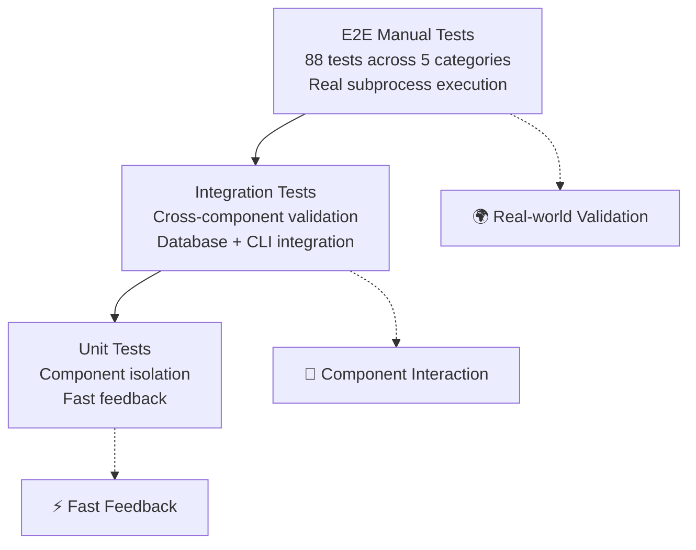

# Testing Guide

> *"Testing leads to failure, and failure leads to understanding."* - Burt Rutan

## Overview

n8n-deploy employs a comprehensive 3-tier testing strategy designed for reliability, maintainability, and developer confidence. The testing framework emphasizes real-world validation while maintaining fast feedback cycles for development.

## Testing Philosophy

### 1. Test Pyramid Strategy


### 2. Core Testing Principles

- **Test environments are sacred**: `N8N_DEPLOY_TESTING=1` prevents side effects
- **Isolation first**: Each test gets its own temporary directory and database
- **Real-world validation**: E2E tests use actual subprocess execution
- **Developer experience**: Verbose output by default with live test progress
- **CI/CD optimized**: Multi-version testing with efficient caching

## Test Framework Architecture

### Test Runner (`run_tests.py`)

The project includes a custom test runner that provides enhanced developer experience:

```bash
# Custom test runner with comprehensive options
python run_tests.py --unit                    # Unit tests only
python run_tests.py --integration             # Integration tests (excluding E2E)
python run_tests.py --e2e                     # E2E manual tests only
python run_tests.py --all                     # Unit + integration
python run_tests.py --all-e2e                 # All tests including E2E
python run_tests.py --report                  # Comprehensive report
python run_tests.py --specific tests/unit/test_models.py  # Specific test
python run_tests.py --quality                 # Code quality checks
```

**Key Features**:
- **Verbose by default**: Real-time test progress with `-v` flag
- **Environment isolation**: Automatic `N8N_DEPLOY_TESTING=1` for integration tests
- **Dependency checking**: Validates test dependencies before running
- **Quality integration**: Combines testing with Black/MyPy checks
- **Coverage reporting**: HTML and terminal coverage reports

### Test Configuration (`pyproject.toml`)

```toml
[tool.pytest.ini_options]
minversion = "6.0"
addopts = "-ra -v --strict-markers --tb=short"
testpaths = ["tests"]
log_cli = true
log_cli_level = "INFO"
markers = [
    "integration: marks tests as integration tests",
    "slow: marks tests as slow-running tests",
]
filterwarnings = [
    "ignore::pydantic.warnings.PydanticDeprecatedSince20",
    "ignore::DeprecationWarning:pydantic.*",
]
```

**Configuration Highlights**:
- **Verbose output**: `-v` flag shows each test name as it runs
- **Live logging**: Real-time log output during test execution
- **Short tracebacks**: `--tb=short` for concise failure information
- **Warning filters**: Suppress known deprecation warnings from dependencies

## Test Categories

### 1. Unit Tests (`tests/unit/`)

**Purpose**: Test individual components in isolation with comprehensive mocking.

**Structure**:
```
tests/unit/
├── test_api_keys.py      # API key management tests
├── test_cli.py           # CLI interface tests
├── test_config.py        # Configuration system tests
├── test_manager.py       # Workflow manager tests
└── test_models.py        # Data model validation tests
```

**Key Patterns**:
```python
def test_workflow_creation_with_valid_data(mock_workflow_data):
    """Unit test with mocked dependencies"""
    workflow = Workflow(**mock_workflow_data)
    assert workflow.id == "test_workflow_123"
    assert workflow.status == WorkflowStatus.ACTIVE

def test_database_connection_error_handling(test_config):
    """Error handling with temporary database"""
    with pytest.raises(sqlite3.OperationalError):
        db = n8n_deploy_DB(db_path="/dev/null/invalid_path")
```

**Running Unit Tests**:
```bash
# Fast execution with coverage
python run_tests.py --unit --coverage

# Direct pytest execution
python -m pytest tests/unit/ -v

# Specific test file
python run_tests.py --specific tests/unit/test_models.py

# With coverage reporting
python run_tests.py --unit --coverage
```

### 2. Integration Tests (`tests/integration/`)

**Purpose**: Validate component interactions and end-to-end workflows without external dependencies.

**Structure**:
```
tests/integration/
├── test_cli_commands.py              # CLI command integration
├── test_discovered_issues.py         # Regression tests
├── test_e2e_apikeys.py               # API key E2E scenarios
├── test_e2e_cli.py                   # CLI E2E scenarios
├── test_e2e_database.py              # Database E2E scenarios
├── test_e2e_server.py                # Server integration E2E
├── test_e2e_workflows.py             # Workflow E2E scenarios
├── test_end_to_end_scenarios.py      # Complex multi-component tests
└── test_workflow_backup_integration.py # Backup system integration
```

**Key Patterns**:
```python
@pytest.mark.integration
def test_workflow_add_and_list_integration(test_config, test_workflow_file):
    """Integration test with real database and file operations"""
    manager = WorkflowManager(config=test_config)

    # Add workflow
    workflow_id = manager.add_workflow(str(test_workflow_file))

    # Verify in database
    workflows = manager.list_workflows()
    assert len(workflows) == 1
    assert workflows[0].id == workflow_id

def test_cli_database_integration(cli_runner, temp_dir):
    """CLI + Database integration via subprocess"""
    result = cli_runner.invoke(cli, ['--app-dir', str(temp_dir), 'db', 'init'])
    assert result.exit_code == 0
    assert "Database initialized" in result.output
```

**Running Integration Tests**:
```bash
# Integration tests (excluding E2E manual tests)
python run_tests.py --integration

# With environment isolation
N8N_DEPLOY_TESTING=1 python -m pytest tests/integration/ -v

# Exclude slow tests
python -m pytest tests/integration/ -m "not slow" -v
```

### 3. E2E Manual Tests (`tests/integration/test_e2e_manual_*.py`)

**Purpose**: Real-world validation using actual subprocess execution to test the CLI as users would experience it.

**88 Comprehensive Tests** across 5 categories:

#### CLI Tests (test_e2e_manual_cli.py)
```python
def test_e2e_cli_help_commands(temp_dir):
    """Test all help commands work correctly"""
    commands = [
        ["./n8n-deploy", "--help"],
        ["./n8n-deploy", "db", "--help"],
        ["./n8n-deploy", "list", "--help"],
    ]

    for cmd in commands:
        result = subprocess.run(cmd, capture_output=True, text=True, cwd=temp_dir.parent)
        assert result.returncode == 0
        assert "Usage:" in result.stdout

def test_e2e_cli_version_and_info(temp_dir):
    """Test version reporting and basic info"""
    result = subprocess.run(
        ["./n8n-deploy", "--version"],
        capture_output=True, text=True, cwd=temp_dir.parent
    )
    assert result.returncode == 0
    assert "2.0.0" in result.stdout
```

#### Database Tests (test_e2e_manual_database.py)
```python
def test_e2e_database_init_and_status(temp_dir):
    """Test database initialization and status checking"""
    env = {"N8N_DEPLOY_APP_DIR": str(temp_dir)}

    # Initialize database
    result = subprocess.run(
        ["./n8n-deploy", "db", "init", "--no-emoji"],
        capture_output=True, text=True, cwd=temp_dir.parent, env=env
    )
    assert result.returncode == 0
    assert "Database initialized" in result.stdout

    # Check status
    result = subprocess.run(
        ["./n8n-deploy", "db", "status", "--no-emoji"],
        capture_output=True, text=True, cwd=temp_dir.parent, env=env
    )
    assert result.returncode == 0
    assert "Database Status" in result.stdout
```

#### API Key Tests (test_e2e_manual_apikeys.py)
```python
def test_e2e_apikey_lifecycle(temp_dir):
    """Test complete API key lifecycle"""
    env = {"N8N_DEPLOY_APP_DIR": str(temp_dir)}

    # Initialize database first
    subprocess.run(["./n8n-deploy", "db", "init"], env=env, cwd=temp_dir.parent)

    # Add API key
    process = subprocess.Popen(
        ["./n8n-deploy", "apikey", "add", "test_key", "--no-emoji"],
        stdin=subprocess.PIPE, stdout=subprocess.PIPE, stderr=subprocess.PIPE,
        text=True, env=env, cwd=temp_dir.parent
    )
    stdout, stderr = process.communicate(input="test_api_key_12345\n")
    assert process.returncode == 0

    # List keys
    result = subprocess.run(
        ["./n8n-deploy", "apikey", "list", "--no-emoji"],
        capture_output=True, text=True, env=env, cwd=temp_dir.parent
    )
    assert result.returncode == 0
    assert "test_key" in result.stdout
```

#### Workflow Tests (test_e2e_manual_workflows.py)
```python
def test_e2e_workflow_operations(temp_dir):
    """Test workflow add, list, and remove operations"""
    env = {"N8N_DEPLOY_APP_DIR": str(temp_dir)}

    # Create test workflow file
    workflow_content = {
        "id": "test_workflow_001",
        "name": "Test Workflow",
        "nodes": [],
        "connections": {}
    }

    workflow_file = temp_dir / "test_workflow.json"
    with open(workflow_file, 'w') as f:
        json.dump(workflow_content, f)

    # Add workflow
    result = subprocess.run(
        ["./n8n-deploy", "add", str(workflow_file), "--no-emoji"],
        capture_output=True, text=True, env=env, cwd=temp_dir.parent
    )
    assert result.returncode == 0

    # List workflows
    result = subprocess.run(
        ["./n8n-deploy", "list", "--no-emoji"],
        capture_output=True, text=True, env=env, cwd=temp_dir.parent
    )
    assert result.returncode == 0
    assert "test_workflow_001" in result.stdout
```

#### Server Integration Tests (test_e2e_manual_server.py)
```python
def test_e2e_server_list_without_server():
    """Test server listing when no server configured"""
    result = subprocess.run(
        ["./n8n-deploy", "list-server", "--no-emoji"],
        capture_output=True, text=True
    )
    # Should fail gracefully without server URL
    assert result.returncode != 0
    assert "server URL" in result.stderr.lower() or "server url" in result.stdout.lower()
```

**E2E Test Features**:
- **Real subprocess execution**: Tests actual CLI commands as users would run them
- **Automatic emoji stripping**: All E2E tests use `--no-emoji` for consistent output
- **Environment isolation**: Each test uses temporary directories and environment variables
- **Comprehensive coverage**: Tests success paths, error conditions, and edge cases
- **Cross-platform compatibility**: Designed to work on Linux, macOS, and Windows

**Running E2E Tests**:
```bash
# Run all E2E manual tests
python run_tests.py --e2e

# Run all tests including E2E
python run_tests.py --all-e2e

# Direct pytest execution
python -m pytest tests/integration/test_e2e_manual_*.py -v

# Specific E2E category
python -m pytest tests/integration/test_e2e_manual_cli.py -v
```

## Test Environment Management

### Environment Variables

```bash
# Core test environment variable
export N8N_DEPLOY_TESTING=1  # Prevents default workflow initialization

# Development testing paths
export N8N_DEPLOY_APP_DIR="/tmp/n8n-deploy-test"
export N8N_FLOW_DIR="/tmp/test-workflows"
export N8N_SERVER_URL="http://localhost:5678"

# CI/CD environment detection
if [ "$CI" = "true" ]; then
    export N8N_DEPLOY_TESTING=1
fi
```

### Test Isolation

Every test gets isolated resources:

```python
@pytest.fixture
def temp_dir() -> Generator[Path, None, None]:
    """Create isolated temporary directory"""
    temp_path = Path(tempfile.mkdtemp())
    try:
        yield temp_path
    finally:
        shutil.rmtree(temp_path, ignore_errors=True)

@pytest.fixture
def test_config(temp_dir: Path) -> n8n_deploy_Config:
    """Isolated configuration for testing"""
    config = n8n_deploy_Config(base_folder=temp_dir)
    config.ensure_directories()
    return config
```

### CI Environment Considerations

The testing framework is designed to work reliably in CI environments:

```python
# CI-safe path testing (Docker containers often run as root)
def test_invalid_directory_creation():
    """Test that works in both user and container environments"""
    # Use /dev/null/invalid_path instead of /nonexistent/path
    # because containers might allow creation of /nonexistent/
    with pytest.raises(OSError):
        Path("/dev/null/invalid_path").mkdir(parents=True)
```

## Test Data and Fixtures

### Comprehensive Fixtures (`tests/conftest.py`)

```python
@pytest.fixture
def mock_workflow_data() -> Dict[str, Any]:
    """Realistic workflow test data"""
    return create_test_workflow_data(
        workflow_id="test_workflow_123",
        name="Test Workflow",
        file_path="workflows/test_workflow.json",
        node_count=5,
        tags=["test", "automation"]
    )

@pytest.fixture
def sample_workflow_json() -> Dict[str, Any]:
    """Valid n8n workflow JSON structure"""
    return create_test_workflow_json(
        workflow_id="test_workflow_123",
        name="Test Workflow",
        versionId="abc123"
    )

@pytest.fixture
def populated_test_db(test_db, mock_workflow_data) -> n8n_deploy_DB:
    """Database pre-populated with test data"""
    workflow = Workflow(**mock_workflow_data)
    test_db.create_workflow(workflow)
    return test_db
```

### Helper Functions (`tests/helpers.py`)

```python
def create_test_workflow_data(**overrides) -> Dict[str, Any]:
    """Create consistent test workflow data with optional overrides"""
    base_data = {
        "id": "test_workflow_001",
        "name": "Test Workflow",
        "file_path": "workflows/test.json",
        "status": WorkflowStatus.ACTIVE,
        "tags": [],
        "node_count": 0,
        "created_at": now_utc(),
        "updated_at": now_utc(),
    }
    base_data.update(overrides)
    return base_data

def create_workflow_file(config: n8n_deploy_Config, workflow_id: str,
                        name: str, relative_path: str) -> Path:
    """Create a real workflow file for integration testing"""
    full_path = config.workflows_path / relative_path
    full_path.parent.mkdir(parents=True, exist_ok=True)

    workflow_json = create_test_workflow_json(workflow_id, name)
    with open(full_path, 'w') as f:
        json.dump(workflow_json, f, indent=2)

    return full_path
```

## Test Development Patterns

### 1. Writing Unit Tests

```python
def test_component_functionality():
    """
    Unit test template:
    1. Arrange - Set up test data and mocks
    2. Act - Execute the function under test
    3. Assert - Verify expected outcomes
    """
    # Arrange
    mock_data = {"key": "value"}

    # Act
    result = function_under_test(mock_data)

    # Assert
    assert result is not None
    assert result["processed"] is True

# Testing error conditions
def test_component_error_handling():
    """Test error paths and exception handling"""
    with pytest.raises(ValueError, match="Expected error message"):
        function_with_validation(invalid_input)

# Testing with fixtures
def test_with_database(test_db, mock_workflow_data):
    """Use fixtures for complex setup"""
    workflow = Workflow(**mock_workflow_data)
    workflow_id = test_db.create_workflow(workflow)

    retrieved = test_db.get_workflow(workflow_id)
    assert retrieved.name == mock_workflow_data["name"]
```

### 2. Writing Integration Tests

```python
@pytest.mark.integration
def test_manager_database_integration(test_config):
    """Integration test connecting multiple components"""
    # Use real components, not mocks
    manager = WorkflowManager(config=test_config)

    # Test full workflow
    workflow_data = create_test_workflow_data()
    workflow_id = manager.add_workflow_from_data(workflow_data)

    # Verify database persistence
    workflows = manager.list_workflows()
    assert len(workflows) == 1
    assert workflows[0].id == workflow_id

def test_cli_manager_integration(cli_runner, test_config):
    """CLI integration with manager layer"""
    # Test CLI commands that use manager
    result = cli_runner.invoke(
        cli,
        ['--app-dir', str(test_config.base_folder), 'list'],
        catch_exceptions=False
    )
    assert result.exit_code == 0
```

### 3. Writing E2E Tests

```python
def test_e2e_real_subprocess(temp_dir):
    """E2E test with actual subprocess execution"""
    env = {"N8N_DEPLOY_APP_DIR": str(temp_dir)}

    # Test actual command execution
    result = subprocess.run(
        ["./n8n-deploy", "db", "init", "--no-emoji"],
        capture_output=True,
        text=True,
        cwd=temp_dir.parent,  # Run from project root
        env=env
    )

    # Verify subprocess results
    assert result.returncode == 0
    assert "Database initialized" in result.stdout
    assert temp_dir / "n8n-deploy.db" exists()

def test_e2e_error_conditions(temp_dir):
    """E2E test for error handling"""
    # Test with invalid configuration
    result = subprocess.run(
        ["./n8n-deploy", "list"],  # No app dir specified
        capture_output=True,
        text=True,
        cwd=temp_dir.parent
    )

    # Should fail gracefully
    assert result.returncode != 0
    assert "Oops!" in result.stderr or "app dir" in result.stderr.lower()
```

## Test Execution Strategies

### Development Testing

```bash
# Fast feedback during development
python run_tests.py --unit                # Quick unit tests
python run_tests.py --specific tests/unit/test_new_feature.py

# Before committing
python run_tests.py --all                 # All tests except E2E
python run_tests.py --quality             # Code quality checks

# Full validation
python run_tests.py --all-e2e             # Everything including E2E
```

### Continuous Integration

```bash
# CI pipeline stages (from .gitlab-ci.yml)

# Stage 1: Fast quality checks
mypy api/ --strict
black --check api/

# Stage 2: Unit tests with coverage
N8N_DEPLOY_TESTING=1 python run_tests.py --unit --coverage

# Stage 3: Integration tests
N8N_DEPLOY_TESTING=1 python run_tests.py --integration

# Stage 4: Multi-version testing
for version in 3.8 3.9 3.10 3.11 3.12; do
    python$version -m pytest tests/unit/ -v
done
```

### Performance Testing

```bash
# Fast test execution
python -m pytest tests/unit/ -x          # Stop on first failure
python -m pytest tests/unit/ -q          # Quiet mode
python -m pytest tests/unit/ --tb=no     # No tracebacks

# Parallel execution (with pytest-xdist)
python -m pytest tests/unit/ -n auto     # Auto-detect CPU cores
python -m pytest tests/unit/ -n 4        # 4 parallel processes

# Profile test execution
python -m pytest tests/unit/ --durations=10  # Show slowest 10 tests
```

## Coverage and Quality Metrics

### Coverage Configuration

```toml
[tool.coverage.run]
source = ["api"]
omit = ["*/tests/*", "*/test_*"]

[tool.coverage.report]
exclude_lines = [
    "pragma: no cover",
    "def __repr__",
    "if __name__ == .__main__.:",
    "raise NotImplementedError",
]
```

### Coverage Execution

```bash
# Unit tests with coverage
python run_tests.py --unit --coverage

# Generate HTML report
python -m pytest tests/unit/ --cov=api --cov-report=html
open htmlcov/index.html

# Terminal coverage report
python -m pytest tests/unit/ --cov=api --cov-report=term

# Coverage thresholds
python -m pytest tests/unit/ --cov=api --cov-fail-under=80
```

### Quality Integration

```bash
# Combined quality and testing
python run_tests.py --quality             # Black + MyPy
python run_tests.py --unit --coverage     # Tests + coverage
python run_tests.py --report              # Comprehensive report

# Generate complete quality report
python run_tests.py --report-e2e          # Everything including E2E
```

## Debugging Tests

### Verbose Test Output

```bash
# Maximum verbosity
python -m pytest tests/unit/test_specific.py -v -s --tb=long

# Live log output
python -m pytest tests/unit/ -v --log-cli-level=DEBUG

# Print statements in tests
python -m pytest tests/unit/ -s          # Don't capture stdout
```

### Debugging Test Failures

```python
def test_with_debugging():
    """Test with debugging assistance"""
    import pdb; pdb.set_trace()           # Debugger breakpoint

    # Or use pytest's builtin debugging
    import pytest; pytest.set_trace()

    # Print debugging info
    print(f"Debug: variable value = {variable}")

    # Use logging in tests
    import logging
    logging.getLogger().setLevel(logging.DEBUG)
    logging.debug("Debug message in test")
```

### Test Database Inspection

```python
def test_with_database_inspection(test_db):
    """Debug database state during tests"""
    # Add test data
    workflow = Workflow(**test_data)
    test_db.create_workflow(workflow)

    # Inspect database state
    cursor = test_db._get_connection().cursor()
    cursor.execute("SELECT * FROM workflows")
    rows = cursor.fetchall()
    print(f"Database rows: {rows}")

    # Use sqlite3 command line tool
    # sqlite3 /tmp/test_db.db ".dump"
```

## Advanced Testing Patterns

### Parameterized Tests

```python
# Example shows basic workflow creation without type field:
def test_workflow_creation():
    """Test basic workflow creation"""
    workflow = Workflow(
        id="test", name="test", file_path="test.json"
    )
    assert workflow.id == "test"
    assert workflow.name == "test"
```

### Mock and Patch Strategies

```python
@patch('api.manager.requests.get')
def test_n8n_api_integration(mock_get, test_manager):
    """Mock external API calls"""
    mock_response = Mock()
    mock_response.status_code = 200
    mock_response.json.return_value = {"data": {"id": "123"}}
    mock_get.return_value = mock_response

    result = test_manager.fetch_from_n8n("test_workflow")
    assert result["data"]["id"] == "123"

@patch.dict(os.environ, {"N8N_DEPLOY_APP_DIR": "/tmp/test"})
def test_environment_override():
    """Test with environment variable overrides"""
    config = get_config()
    assert str(config.base_folder) == "/tmp/test"
```

### Test Categories and Markers

```python
# Mark slow tests
@pytest.mark.slow
def test_large_dataset_processing():
    """Tests that take more than a few seconds"""
    pass

# Mark integration tests
@pytest.mark.integration
def test_component_interaction():
    """Tests that cross component boundaries"""
    pass

# Mark tests requiring external resources
@pytest.mark.external
def test_n8n_server_integration():
    """Tests requiring live n8n server"""
    pass

# Skip tests conditionally
@pytest.mark.skipif(sys.platform == "win32", reason="Unix-only test")
def test_unix_specific_functionality():
    pass
```

### Test Execution Control

```bash
# Run only specific markers
python -m pytest -m "not slow"           # Skip slow tests
python -m pytest -m "integration"        # Only integration tests
python -m pytest -m "not external"       # Skip external dependencies

# Combine markers
python -m pytest -m "integration and not slow"

# Run tests matching pattern
python -m pytest -k "workflow"           # Tests with "workflow" in name
python -m pytest -k "not database"       # Skip database tests
```

## Best Practices and Guidelines

### 1. Test Structure

- **Arrange-Act-Assert**: Clear test structure with distinct phases
- **One assertion per test**: Focus each test on a single behavior
- **Descriptive test names**: `test_workflow_creation_with_invalid_data_raises_validation_error`
- **Use fixtures**: Reusable test setup with proper cleanup

### 2. Test Data

- **Realistic test data**: Use helpers to create consistent, realistic test data
- **Avoid magic values**: Use constants or fixtures for test values
- **Independent tests**: Each test should work regardless of execution order
- **Clean up**: Ensure tests don't leave artifacts

### 3. Mocking Strategy

- **Mock external dependencies**: Network calls, file system (when appropriate)
- **Don't mock what you own**: Test real interactions between your components
- **Mock at boundaries**: Mock at integration points, not internal components
- **Verify mock calls**: Assert that mocks were called with expected parameters

### 4. Error Testing

- **Test error paths**: Ensure error conditions are properly handled
- **Test edge cases**: Boundary conditions, empty inputs, invalid data
- **Test failure modes**: Network failures, permission errors, missing files
- **Graceful degradation**: Verify system behavior when components fail

## Troubleshooting Common Issues

### Test Failures

```bash
# Clear pytest cache
rm -rf .pytest_cache/

# Clear coverage data
rm -f .coverage
rm -rf htmlcov/

# Recreate virtual environment
rm -rf .venv/
python -m venv .venv
source .venv/bin/activate
pip install -e ".[dev,test]"
```

### Environment Issues

```bash
# Check environment variables
env | grep N8N_DEPLOY

# Reset test environment
unset N8N_DEPLOY_APP_DIR N8N_FLOW_DIR N8N_SERVER_URL
export N8N_DEPLOY_TESTING=1
```

### Database Issues

```bash
# Check database file permissions
ls -la /tmp/test/n8n-deploy.db

# Reset test database
rm -f /tmp/test/n8n-deploy.db
python run_tests.py --unit
```

---

*The testing framework is designed to give you confidence in your code changes while maintaining fast feedback cycles. When in doubt, write more tests!*
