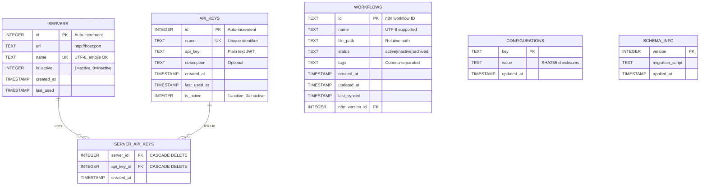

# Database Management

> "A backup of uncertain quality is equivalent to no backup at all." — Ancient DevOps Wisdom

n8n-deploy uses SQLite as its metadata store, providing a reliable, efficient, and portable solution for tracking workflows, API keys, and server configurations.

## 🎯 Database Overview

The n8n-deploy database serves as the single source of truth for:
- **Workflow Metadata**: Track workflow files, sync status, and version information
- **API Keys**: Store and manage n8n server authentication credentials
- **Server Configurations**: Maintain multiple n8n server connections
- **Backup History**: Record database backup operations with SHA256 verification

### Database Architecture



---

## 🚀 Database Operations

### Initialize Database

Create the SQLite database with required schema:

```bash
# Basic initialization
n8n-deploy db init

# Initialize with custom directory
n8n-deploy --data-dir /opt/n8n-deploy db init

# Initialize with custom filename
n8n-deploy db init --filename my-workflows.db

# JSON output for automation
n8n-deploy db init --json --no-emoji
```

**What happens during initialization:**
1. Creates SQLite database file
2. Sets up schema with 5 tables
3. Initializes schema versioning
4. Creates indexes for performance

{: .note }
> If the database already exists, you'll be prompted for confirmation. Use `--import` flag to accept existing databases without prompting.

### Check Database Status

View comprehensive database statistics:

```bash
# Rich emoji output
n8n-deploy db status

# Script-friendly output
n8n-deploy db status --no-emoji

# JSON for parsing
n8n-deploy db status --json
```

**Status information includes:**
- Database file location and size
- Schema version
- Record counts (workflows, API keys, servers)
- Last backup timestamp
- Database integrity status

**Example output:**
```
📊 Database Status

Database Path: /home/user/.n8n-deploy/n8n-deploy.db
Size: 128 KB
Schema Version: 2.0

📈 Statistics:
  Workflows: 15
  API Keys: 3
  Servers: 2
  Backups: 5

✅ Database is healthy
```

### Backup Database

Create timestamped database backups:

```bash
# Backup to default location
n8n-deploy db backup

# Backup to specific path
n8n-deploy db backup /backups/n8n-deploy-$(date +%Y%m%d).db

# With custom data directory
n8n-deploy --data-dir /opt/n8n-deploy db backup
```

**Backup features:**
- **Atomic operations**: Backup completes or fails entirely
- **SHA256 checksums**: Verify backup integrity
- **Metadata tracking**: Store backup history in database
- **No downtime**: Backup while using the database

{: .warning }
> **Important**: Backups only include the database file (metadata). Workflow JSON files are separate and should be managed with git version control.

### Compact Database

Optimize database storage by reclaiming unused space:

```bash
# Compact database
n8n-deploy db compact

# Compact with script-friendly output
n8n-deploy db compact --no-emoji
```

**When to compact:**
- After deleting many workflows
- After removing unused API keys
- Monthly maintenance routine
- Before creating backups

**What compacting does:**
- Runs SQLite `VACUUM` command
- Rebuilds database file
- Reclaims deleted space
- Defragments data pages
- Rebuilds indexes

{: .tip }
> **Best Practice**: Compact before creating backups to reduce backup file size.

---

## 🏗️ Database Schema

The database architecture diagram above shows all tables and their relationships. Key points:

**Core Tables:**
- **workflows** - Workflow metadata (id, name, file_path, status, tags, timestamps)
- **api_keys** - Authentication keys with lifecycle tracking
- **servers** - n8n server configurations with UTF-8 name support
- **server_api_keys** - Many-to-many junction table linking servers to API keys
- **configurations** - Backup metadata with SHA256 checksums
- **schema_info** - Database version tracking for migrations

{: .warning }
> **Security Note**: API keys are stored in plain text. Secure the database file with appropriate filesystem permissions (chmod 600).

---

## 🔧 Real-World DevOps Scenarios

### Scenario 1: Multi-Environment Setup

Manage separate databases for development, staging, and production:

```bash
# Development environment
export N8N_DEPLOY_DATA_DIR=~/dev/n8n-deploy
n8n-deploy db init
n8n-deploy apikey add dev_key

# Staging environment
export N8N_DEPLOY_DATA_DIR=~/staging/n8n-deploy
n8n-deploy db init
n8n-deploy apikey add staging_key

# Production environment
export N8N_DEPLOY_DATA_DIR=/opt/n8n-deploy/production
n8n-deploy db init
n8n-deploy apikey add prod_key
```

### Scenario 2: Automated Backup Strategy

Daily backup script for CI/CD integration:

```bash
#!/bin/bash
# daily-backup.sh

BACKUP_DIR="/backups/n8n-deploy"
TIMESTAMP=$(date +%Y%m%d_%H%M%S)
BACKUP_FILE="${BACKUP_DIR}/n8n-deploy_${TIMESTAMP}.db"

# Create backup
n8n-deploy db backup "${BACKUP_FILE}" --no-emoji

# Verify backup
if [ -f "${BACKUP_FILE}" ]; then
    echo "✓ Backup created: ${BACKUP_FILE}"

    # Compact database monthly (on 1st of month)
    if [ $(date +%d) -eq 01 ]; then
        n8n-deploy db compact --no-emoji
        echo "✓ Database compacted"
    fi

    # Keep only last 30 days of backups
    find "${BACKUP_DIR}" -name "n8n-deploy_*.db" -mtime +30 -delete
else
    echo "✗ Backup failed"
    exit 1
fi
```

### Scenario 3: Database Migration

Move database to new server:

```bash
# On old server
n8n-deploy db backup /tmp/n8n-deploy-migration.db
scp /tmp/n8n-deploy-migration.db newserver:/opt/n8n-deploy/

# On new server
export N8N_DEPLOY_DATA_DIR=/opt/n8n-deploy
mv /opt/n8n-deploy/n8n-deploy-migration.db /opt/n8n-deploy/n8n-deploy.db
n8n-deploy db status
```

### Scenario 4: Health Check Monitoring

Automated database health checks:

```bash
#!/bin/bash
# health-check.sh

# Check database status (JSON output)
STATUS=$(n8n-deploy db status --json --no-emoji)

# Parse JSON (requires jq)
WORKFLOWS=$(echo "$STATUS" | jq -r '.workflows')
SIZE=$(echo "$STATUS" | jq -r '.size_kb')

if [ "$WORKFLOWS" -gt 0 ] && [ "$SIZE" -lt 10000 ]; then
    echo "✓ Database healthy: ${WORKFLOWS} workflows, ${SIZE}KB"
    exit 0
else
    echo "✗ Database issue detected"
    exit 1
fi
```

---

## 🛠️ Performance Optimization

### Database Size Management

| Workflows | Expected Size | Action Threshold |
|-----------|---------------|------------------|
| 1-50 | < 1 MB | Normal operation |
| 51-200 | 1-5 MB | Monitor growth |
| 201-500 | 5-20 MB | Monthly compact |
| 500+ | 20+ MB | Weekly compact |

### Optimization Strategies

#### 1. Regular Compaction

```bash
# Add to monthly cron job
0 2 1 * * /usr/local/bin/n8n-deploy db compact --no-emoji
```

#### 2. Backup Rotation

```bash
# Keep only recent backups
find /backups -name "*.db" -mtime +30 -delete
```

#### 3. Index Maintenance

- Indexes are automatically maintained by SQLite
- Compacting rebuilds indexes for optimal performance
- No manual index management required

#### 4. File System Considerations

- Use SSD storage for database directory
- Ensure sufficient disk space (2x database size minimum)
- Enable filesystem compression if available (ext4, btrfs)

---

## 🔒 Security Best Practices

### File Permissions

```bash
# Secure database file
chmod 600 ~/.n8n-deploy/n8n-deploy.db

# Secure data directory
chmod 700 ~/.n8n-deploy
```

### Backup Security

```bash
# Encrypt backups for long-term storage
n8n-deploy db backup /tmp/backup.db
gpg --encrypt --recipient admin@example.com /tmp/backup.db
rm /tmp/backup.db

# Decrypt when needed
gpg --decrypt backup.db.gpg > restored.db
```

### Access Control

For multi-user environments:
```bash
# Create dedicated user
sudo useradd -r -s /bin/false n8n-deploy

# Set ownership
sudo chown -R n8n-deploy:n8n-deploy /opt/n8n-deploy

# Limit access
sudo chmod 750 /opt/n8n-deploy
```

---

## 🆘 Troubleshooting

### Database Locked

**Error**: `database is locked`

**Causes**:
- Another n8n-deploy process is running
- Backup operation in progress
- File system lock not released

**Solutions**:
```bash
# Check for running processes
ps aux | grep n8n-deploy

# Wait for operations to complete
sleep 5 && n8n-deploy db status

# Force unlock (use with caution)
fuser /path/to/n8n-deploy.db
```

### Corrupted Database

**Error**: `database disk image is malformed`

**Recovery steps**:
```bash
# 1. Restore from latest backup
cp /backups/latest.db ~/.n8n-deploy/n8n-deploy.db

# 2. Verify integrity
n8n-deploy db status

# 3. If no backup available, attempt repair
sqlite3 corrupted.db "PRAGMA integrity_check;"
sqlite3 corrupted.db ".dump" | sqlite3 repaired.db
```

### Performance Issues

**Symptoms**: Slow operations, high CPU usage

**Diagnosis**:
```bash
# Check database size
n8n-deploy db status | grep Size

# Analyze query performance
sqlite3 n8n-deploy.db "PRAGMA stats;"
```

**Solutions**:
```bash
# Compact database
n8n-deploy db compact

# Check filesystem
df -h /path/to/database

# Monitor I/O
iotop -o | grep n8n-deploy
```

### Missing Database

**Error**: `Oops! Database not found`

**Solutions**:
```bash
# Initialize new database
n8n-deploy db init

# Or restore from backup
n8n-deploy db init --import /backups/latest.db
```

---

## 📖 Related Documentation

- [Getting Started](getting-started/) - Initial setup guide
- [API Key Management](apikeys/) - Manage authentication
- [Server Management](servers/) - Configure n8n servers
- [Configuration](configuration/) - Environment variables and settings
- [Troubleshooting](troubleshooting/) - Common issues and solutions

---

## 💡 Pro Tips

1. **Automate Backups**: Schedule daily backups via cron or systemd timers
2. **Monitor Size**: Set up alerts for database growth beyond expected thresholds
3. **Test Restores**: Regularly verify backup integrity by testing restoration
4. **Version Control**: Keep database schema migrations in git
5. **Document Changes**: Use CHANGELOG.md to track schema evolution
6. **Separate Environments**: Never mix development and production databases
7. **Compact Regularly**: Monthly compaction prevents performance degradation
8. **Secure Storage**: Encrypt backups stored off-site or in cloud storage

---

**Last Updated**: October 2025
**Schema Version**: 2.0
