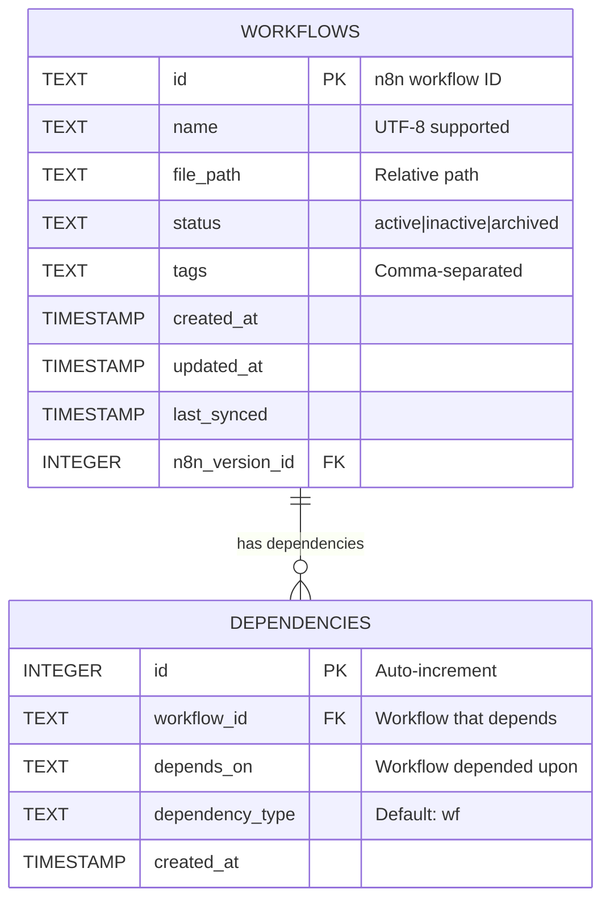
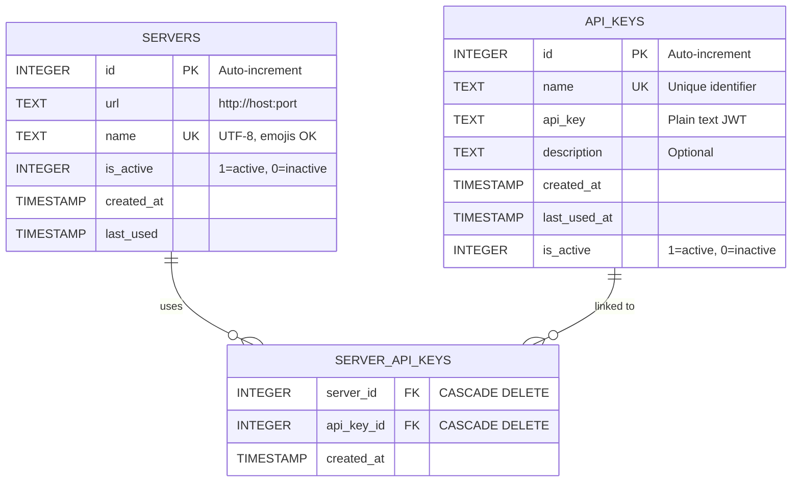
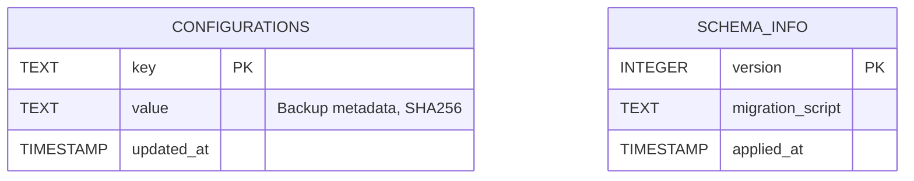

# Database Management

> "A backup of uncertain quality is equivalent to no backup at all." — Ancient DevOps Wisdom

n8n-deploy uses SQLite as its metadata store, providing a reliable, efficient, and portable solution for managing workflows, API keys, and server configurations.

## 🎯 Database Overview

The n8n-deploy database serves as the single source of truth for:
- **Workflow Metadata**: Workflow files, sync status, and version information
- **API Keys**: n8n server authentication credentials
- **Server Configurations**: Multiple n8n server connections
- **Backup History**: Database backup operations with SHA256 verification

### Database Architecture

#### 1. Workflow Management



#### 2. Server & API Key Management



#### 3. Configuration & Schema Tracking



---

## 🚀 Database Operations

### Initialize Database

Create the SQLite database with required schema:

```bash
# Basic initialization
n8n-deploy db init

# Initialize with custom directory
n8n-deploy --data-dir /opt/n8n-deploy db init

# Initialize with custom filename
n8n-deploy db init --filename my-workflows.db

# JSON output for automation
n8n-deploy db init --json --no-emoji
```

**What happens during initialization:**
1. Creates SQLite database file
2. Sets up schema with 5 tables
3. Initializes schema versioning
4. Creates indexes for performance

{: .note }
> If the database already exists, you'll be prompted for confirmation. Use `--import` flag to accept existing databases without prompting.

### Check Database Status

View database statistics:

```bash
# Rich emoji output
n8n-deploy db status

# Script-friendly output
n8n-deploy db status --no-emoji

# JSON for parsing
n8n-deploy db status --json
```

**Status information includes:**
- Database file location and size
- Schema version
- Record counts (workflows, API keys, servers)
- Last backup timestamp
- Database integrity status

### Backup Database

Create timestamped database backups:

```bash
# Backup to default location
n8n-deploy db backup

# Backup to specific path
n8n-deploy db backup /backups/n8n-deploy-$(date +%Y%m%d).db

# With custom data directory
n8n-deploy --data-dir /opt/n8n-deploy db backup
```

**Backup features:**
- **Atomic operations**: Backup completes or fails entirely
- **SHA256 checksums**: Verify backup integrity
- **Metadata tracking**: Store backup history in database
- **No downtime**: Backup while using the database

{: .warning }
> **Important**: Backups only include the database file (metadata). Workflow JSON files should be managed with git version control.

### Compact Database

Optimize database storage:

```bash
# Compact database
n8n-deploy db compact

# Script-friendly output
n8n-deploy db compact --no-emoji
```

**When to compact:**
- After deleting many workflows
- After removing unused API keys
- Monthly maintenance routine
- Before creating backups

---

## 🏗️ Database Schema

**1. Workflow Management** - Core workflow management with dependency relationships
- **workflows** - Workflow metadata with UTF-8 names, file paths, status, and sync management
- **dependencies** - Records which workflows depend on other workflows. Each row stores `workflow_id` (the workflow that has a dependency) and `depends_on` (the workflow it depends upon). Used for future graph-push functionality to deploy workflows in correct order.

**2. Server & API Key Management** - Multi-server authentication system
- **servers** - n8n server configurations (UTF-8 names, emojis supported)
- **api_keys** - Plain text JWT tokens with lifecycle management
- **server_api_keys** - Many-to-many junction table with CASCADE delete

**3. Configuration & Schema** - System metadata and versioning
- **configurations** - Backup metadata with SHA256 integrity checksums
- **schema_info** - Database version management for migration processes

{: .warning }
> **Security**: API keys stored in plain text. Protect database with `chmod 600` permissions.

---

## 🆘 Common Issues

### Database Locked

**Error**: `database is locked`

**Solutions**:
```bash
# Check for running processes
ps aux | grep n8n-deploy

# Wait for operations to complete
sleep 5 && n8n-deploy db status
```

### Corrupted Database

**Error**: `database disk image is malformed`

**Recovery**:
```bash
# Restore from backup
cp /backups/latest.db ~/.n8n-deploy/n8n-deploy.db

# Verify integrity
n8n-deploy db status
```

### Missing Database

**Error**: `Oops! Database not found`

**Solutions**:
```bash
# Initialize new database
n8n-deploy db init

# Or restore from backup
n8n-deploy db init --import /backups/latest.db
```

---

## 📖 Related Documentation

- [Getting Started](getting-started/) - Initial setup guide
- [API Key Management](apikeys/) - Manage authentication
- [Server Management](servers/) - Configure n8n servers
- [DevOps Integration](user-guide/devops-integration/) - CI/CD workflows and automation
- [Configuration](configuration/) - Environment variables and settings
- [Troubleshooting](troubleshooting/) - Common issues and solutions

---

**Last Updated**: October 2025
**Schema Version**: 2.0
