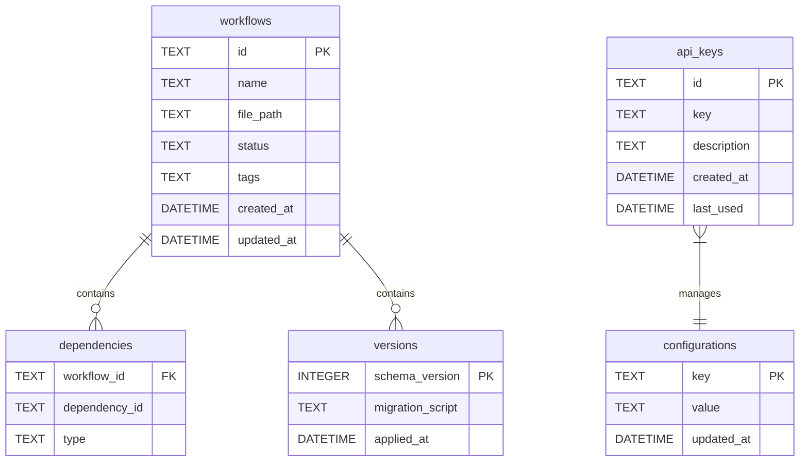

# Database Schema

{: .warning }
> Detailed overview of n8n-deploy's SQLite database structure and management.

## Schema Overview

n8n-deploy uses a lightweight, efficient SQLite database to manage workflow metadata and configurations.

### Database Tables



## Table Descriptions

### 1. `workflows` Table
- **Purpose**: Store workflow metadata
- **Key Fields**:
  - `id`: Unique workflow identifier
  - `name`: Workflow display name
  - `file_path`: Path to workflow JSON
  - `status`: Current workflow status
  - `tags`: User-defined tags
  - `created_at`: Creation timestamp
  - `updated_at`: Last modification timestamp

### 2. `api_keys` Table
- **Purpose**: Manage API key information
- **Key Fields**:
  - `id`: Unique key identifier
  - `key`: Plain-text API key
  - `description`: Optional key description
  - `created_at`: Key creation timestamp
  - `last_used`: Last usage timestamp

### 3. `configurations` Table
- **Purpose**: Store application configurations
- **Key Fields**:
  - `key`: Configuration key
  - `value`: Configuration value
  - `updated_at`: Last update timestamp

### 4. `dependencies` Table
- **Purpose**: Track workflow dependencies
- **Key Fields**:
  - `workflow_id`: Parent workflow ID
  - `dependency_id`: Dependent workflow ID
  - `type`: Dependency type

### 5. `versions` Table
- **Purpose**: Track database schema versions
- **Key Fields**:
  - `schema_version`: Incremental version number
  - `migration_script`: SQL migration script
  - `applied_at`: Migration timestamp

## Schema Versioning

```python
# Example schema version management
SCHEMA_VERSION = 2  # Current database schema version

def check_schema_version(current_version: int) -> bool:
    """Check and potentially migrate database schema."""
    if current_version < SCHEMA_VERSION:
        apply_migrations(current_version)
    return True
```

## Migration Strategies

{: .tip }
> Migrations are designed to be backward-compatible and non-destructive.

### Migration Principles
1. Incremental version updates
2. Preserve existing data
3. Minimal downtime
4. Rollback support

### Migration Example
```python
def migrate_v1_to_v2():
    """Example migration script."""
    # Add new columns
    # Populate with default values
    # Maintain data integrity
```

## Best Practices

1. Always backup database before migrations
2. Test migrations in isolated environments
3. Use transactions for migration safety
4. Provide clear migration path

{: .warning }
> Improper migrations can lead to data loss.

## Performance Considerations

- Indexes on frequently queried columns
- Minimal normalization for speed
- SQLite-specific optimization techniques

### Indexing Strategy
```sql
-- Example index creation
CREATE INDEX idx_workflows_name ON workflows(name);
CREATE INDEX idx_api_keys_created_at ON api_keys(created_at);
```

## Security Notes

{: .note }
> "Security is not a product, but a process." — Bruce Schneier

- No encryption of stored keys
- File-level permissions critical
- Recommend restrictive file modes (600)

## Backup and Recovery

```bash
# Backup database
n8n-deploy db backup

# Restore from backup
n8n-deploy db restore backup_file.db
```

{: .tip }
> Regular backups are your best defense against data loss.