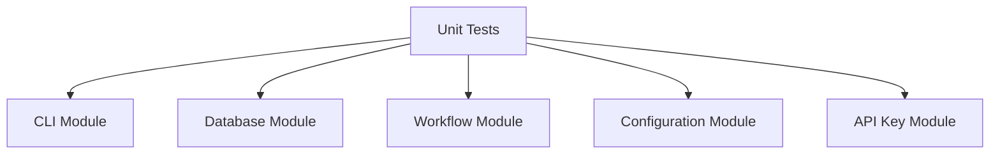
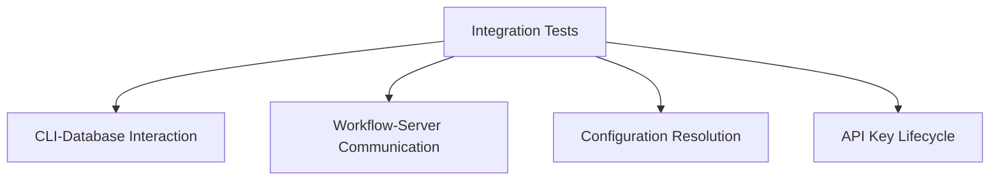
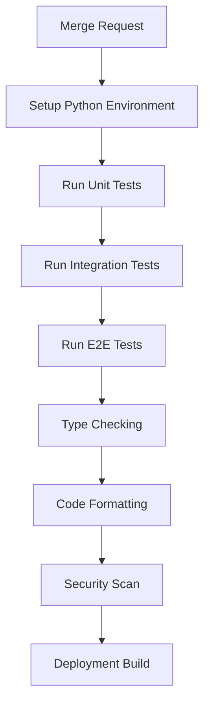

# Testing Framework

{: .warning }
> Thorough testing is critical to maintaining code quality and preventing regressions.

## Testing Philosophy

n8n-deploy employs a comprehensive, multi-layered testing approach:
- **Unit Tests**: Individual component validation
- **Integration Tests**: Component interaction testing
- **End-to-End (E2E) Tests**: Real-world scenario validation
- **Property-Based Testing**: Automated test case generation

## Test Types

### Unit Tests



- Located in `tests/unit/`
- Test individual functions and classes
- Mock external dependencies
- 100% coverage goal for core modules

### Integration Tests



- Located in `tests/integration/`
- Test interactions between modules
- Validate complex workflows
- Ensure components work together correctly

### End-to-End (E2E) Tests

- Full CLI command testing
- Real subprocess execution
- Validate complete user scenarios
- Uses `--no-emoji` for consistent output

### Property-Based Testing

- Uses Hypothesis framework
- Generates 750+ test cases automatically
- Finds edge cases human testers might miss

## Running Tests

```bash
# Run all tests
python run_tests.py --all

# Unit tests only
python run_tests.py --unit

# Integration tests
python run_tests.py --integration

# E2E tests
python run_tests.py --e2e

# Hypothesis property tests
pytest tests/generators/hypothesis_generator.py -v
```

## Test Environment Configuration

{: .note }
> `N8N_DEPLOY_TESTING=1` prevents default workflow initialization during tests.

### Test Database

- Isolated test database
- Automatic cleanup after tests
- No persistent state between test runs

### Configuration Testing

- Test multiple config sources
- Validate precedence rules
- Check error handling

## Best Practices

{: .tip }
> "Test your code like you want others to test your parachute." — Anonymous

1. **Write Tests First**: TDD approach
2. **Keep Tests Simple**
3. **Test Edge Cases**
4. **Use Meaningful Test Names**
5. **Avoid Test Interdependence**

## Continuous Integration

- Full test suite runs on every merge request
- Coverage reports generated
- Static type checking
- Code quality scans

### CI Pipeline Stages



## Troubleshooting Tests

{: .warning }
> Common issues and their solutions.

### Flaky Tests
- Add retries
- Isolate external dependencies
- Use deterministic random seeds

### Performance
- Profile slow tests
- Mock heavy operations
- Use `pytest-xdist` for parallel testing

{: .note }
> Good tests are a developer's best friend, catching issues before they reach production.