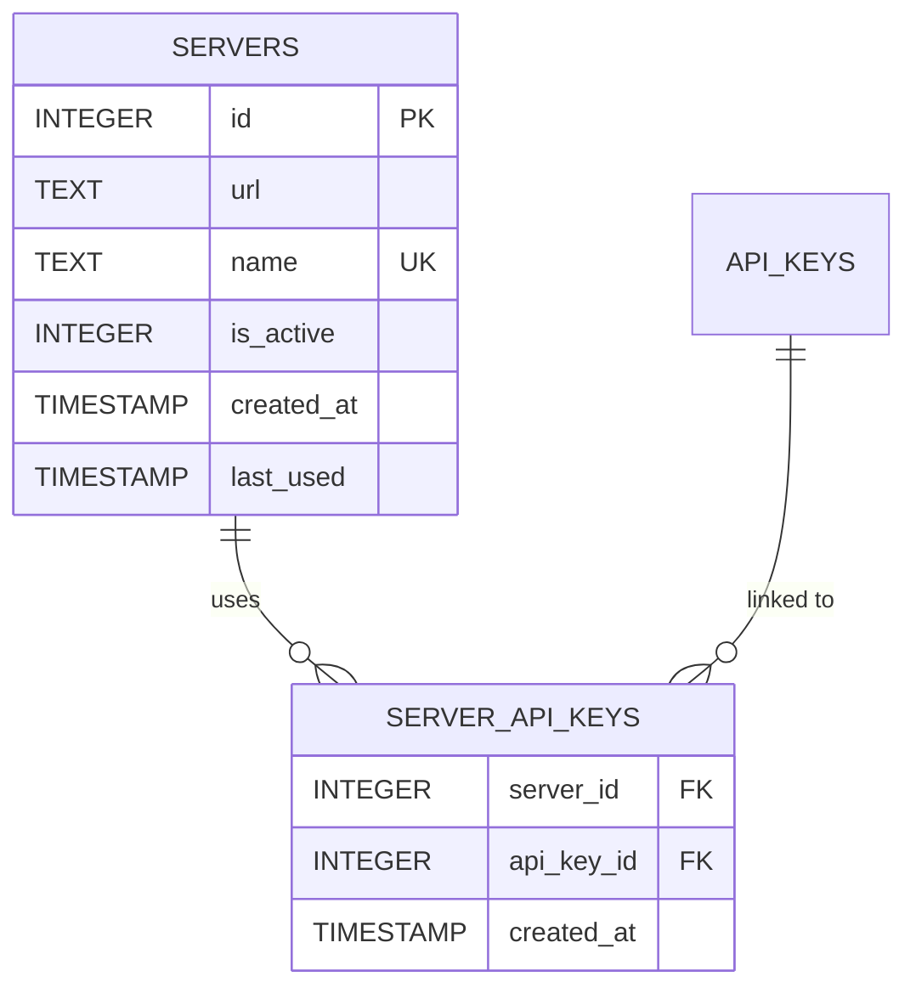

# Server Management

> "If you can't manage one server, adding more won't help." — Murphy's Law of Distributed Systems

n8n-deploy enables management of multiple n8n server connections, each with dedicated API keys and configurations for seamless multi-environment workflows.

## 🎯 Overview

Server management in n8n-deploy provides:
- **Multi-Server Support**: Connect to development, staging, and production n8n instances
- **Server-Key Linking**: Associate specific API keys with servers
- **UTF-8 Names**: Use descriptive names with international characters and emojis
- **Active/Inactive States**: Toggle server availability without deletion
- **Centralized Configuration**: All servers managed from single database

---

## 🖥️ Server Operations

### Create Server

Register a new n8n server:

```bash
# Basic server creation
n8n-deploy server create "Production" http://n8n.example.com:5678

# UTF-8 server names with emojis
n8n-deploy server create "Production 🚀" https://n8n-prod.company.com
n8n-deploy server create "Dev 🔧" http://localhost:5678
n8n-deploy server create "Staging 🧪" http://n8n-staging:5678

# Create and link API key in one workflow
n8n-deploy server create "QA Server" http://n8n-qa:5678
echo "$QA_API_KEY" | n8n-deploy apikey add - --name qa_key --server "QA Server"
```

**Server naming guidelines:**
- UTF-8 characters supported (emojis, international text)
- No path separators (/, \)
- Must be unique across all servers
- Descriptive names recommended

{: .tip }
> **Pro Tip**: Use emojis to quickly identify server environments: 🚀 Production, 🧪 Staging, 🔧 Development

### List Servers

View all configured servers:

```bash
# All servers (rich output)
n8n-deploy server list

# Active servers only
n8n-deploy server list --active

# Script-friendly output
n8n-deploy server list --no-emoji

# JSON format
n8n-deploy server list --json
```

**Example output:**
```
🖥️  n8n Servers

┌─────────────────────┬────────────────────────────────┬────────┬─────────────────────┐
│ Name                │ URL                            │ Status │ Created             │
├─────────────────────┼────────────────────────────────┼────────┼─────────────────────┤
│ Production 🚀       │ https://n8n.example.com        │ ✅ Active │ 2025-09-01 10:00:00 │
│ Staging 🧪          │ http://n8n-staging:5678        │ ✅ Active │ 2025-09-15 14:30:00 │
│ Dev 🔧              │ http://localhost:5678          │ ✅ Active │ 2025-09-20 09:00:00 │
└─────────────────────┴────────────────────────────────┴────────┴─────────────────────┘

Total: 3 servers (3 active)
```

### View Server API Keys

Display all API keys linked to a server:

```bash
# View keys for server
n8n-deploy server keys "Production 🚀"

# JSON output
n8n-deploy server keys "Staging 🧪" --json
```

**Example output:**
```
🔑 API Keys for Server: Production 🚀

┌─────────────────┬─────────────────────┬─────────────────────┐
│ Key Name        │ Created             │ Linked              │
├─────────────────┼─────────────────────┼─────────────────────┤
│ prod_admin      │ 2025-09-01 10:30:00 │ 2025-09-01 10:31:00 │
│ prod_readonly   │ 2025-09-15 14:00:00 │ 2025-09-15 14:05:00 │
└─────────────────┴─────────────────────┴─────────────────────┘

Total: 2 keys linked
```

### Remove Server

Delete a server from configuration:

```bash
# Remove with confirmation prompt
n8n-deploy server remove "Old Server"

# Skip confirmation
n8n-deploy server remove "Temp Server" --confirm

# Preserve linked API keys (default)
n8n-deploy server remove "Staging 🧪" --preserve-keys
```

**Removal behavior:**
- `--preserve-keys` (default): Keeps all linked API keys intact
- `--delete-keys`: Deletes API keys used **exclusively** by this server
- Shared keys are never deleted automatically

{: .warning }
> **Important**: Removing a server does not affect workflow files or database workflows. Only the server configuration is deleted.

---

## 🔗 Server-API Key Management

### Linking Workflow

Associate API keys with servers for automatic authentication:

```bash
# Method 1: Link during API key creation
echo "$API_KEY" | n8n-deploy apikey add - --name prod_key --server "Production 🚀"

# Method 2: Link during server creation
n8n-deploy server create "Staging" http://staging.n8n.com
echo "$STAGING_KEY" | n8n-deploy apikey add - --name staging_key --server "Staging"
```

### Multi-Key Scenarios

Servers can have multiple API keys for different purposes:

```bash
# Production server with multiple keys
n8n-deploy server create "Production 🚀" https://n8n-prod.com

# Admin key (full access)
echo "$ADMIN_KEY" | n8n-deploy apikey add - --name prod_admin --server "Production 🚀"

# Read-only key (monitoring)
echo "$READONLY_KEY" | n8n-deploy apikey add - --name prod_readonly --server "Production 🚀"

# View all keys
n8n-deploy server keys "Production 🚀"
```

---

## 🏗️ Database Schema



**Relationships:**
- Servers can have multiple API keys (one-to-many)
- API keys can be linked to multiple servers (many-to-many)
- Deleting a server cascades to `server_api_keys` but preserves `api_keys`

---

## 🆘 Common Issues

### Server Already Exists

**Error**: `UNIQUE constraint failed: servers.name`

**Solutions**:
```bash
# List existing servers
n8n-deploy server list

# Remove old server
n8n-deploy server remove "Conflicting Name" --confirm

# Use different name
n8n-deploy server create "Staging v2" http://n8n-staging:5678
```

### Connection Refused

**Error**: `Failed to connect to server`

**Diagnosis**:
```bash
# Check server URL
n8n-deploy server list --json | jq -r '.[] | select(.name=="Production") | .url'

# Test connectivity
curl "$SERVER_URL/healthz"
```

**Solutions**:
- Verify server URL is correct (protocol, hostname, port)
- Check firewall rules
- Ensure n8n service is running

### No API Keys Linked

**Error**: `No API keys linked to server 'XYZ'`

**Solutions**:
```bash
# List available API keys
n8n-deploy apikey list

# Link existing key
echo "$API_KEY" | n8n-deploy apikey add - --name key_for_xyz --server "XYZ"

# Verify linking
n8n-deploy server keys "XYZ"
```

---

## 📖 Related Documentation

- [API Key Management](apikeys/) - Manage authentication keys
- [Workflow Management](workflows/) - Push/pull workflows using servers
- [DevOps Integration](user-guide/devops-integration/) - CI/CD automation and advanced scenarios
- [Configuration](configuration/) - Environment variables and settings
- [Troubleshooting](troubleshooting/) - Common issues and solutions

---

## 🎯 Quick Command Reference

| Operation | Command |
|-----------|---------|
| Create server | `n8n-deploy server create "Name" URL` |
| List servers | `n8n-deploy server list` |
| Active servers | `n8n-deploy server list --active` |
| Server keys | `n8n-deploy server keys "Name"` |
| Remove server | `n8n-deploy server remove "Name"` |
| JSON output | `n8n-deploy server list --json` |

---

**Last Updated**: October 2025
**Feature Status**: Stable (v2.x)
